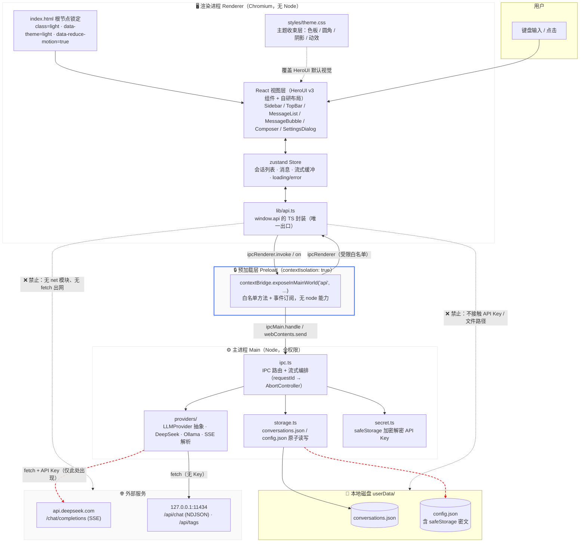
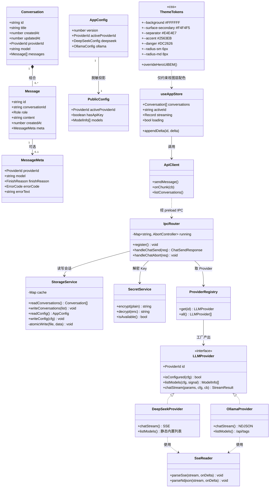
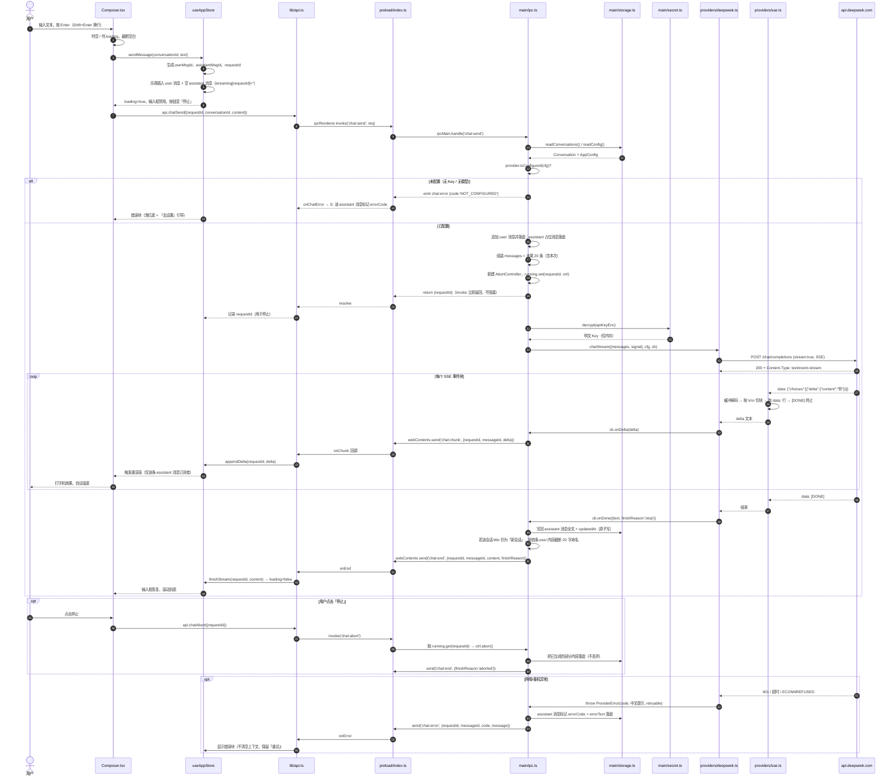
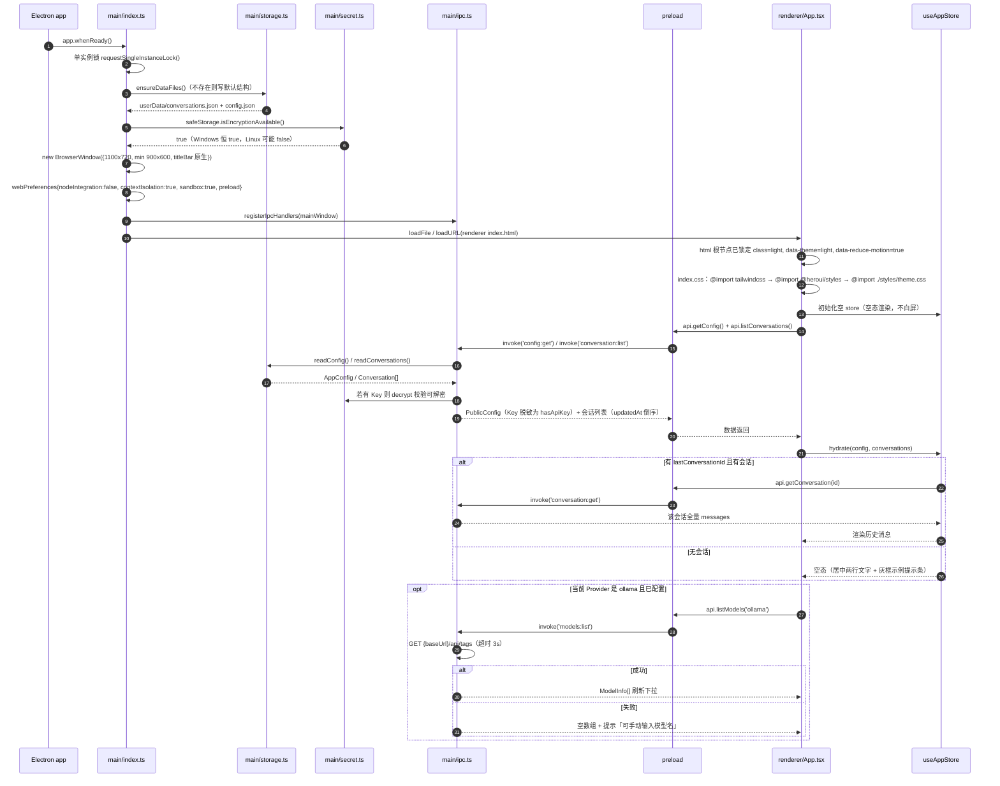

# mini-agent 系统架构设计

> 版本：v1.1（UI 层变更：HeroUI v3 + Tailwind v4） ｜ 作者：高见远（架构师） ｜ 输入：许清楚《mini-agent PRD》
> 目标：**先给架构，再做最小可用版本（MVP）** —— 只有「会话历史 + 输入 + 输出」，但流式输出必须跑通。
> HeroUI 版本与集成方式已通过官方文档核实，依据来源见 §1.4.1。

---

## 0. 设计前提（已锁死，不再讨论）

| # | 前提 |
|---|---|
| D1 | Electron + Vite + React + TypeScript + Tailwind CSS **v4** + **HeroUI v3**；**禁止 MUI**、禁止其它 UI 库 |
| D2 | 流式输出是 MVP 必做项；Provider 接口必须带增量回调，IPC 必须是「事件推送」而非单次返回 |
| D3 | MVP 范围 = 会话历史 + 输入输出。不做：工具调用 / 技能 / 多模态 / 插件 / 云同步 / 账号 / 多窗口 |
| D4 | 渲染进程**不得直连网络、不得持有 API Key**；`contextIsolation: true`、`nodeIntegration: false` |
| D5 | API Key 用 Electron 内置 `safeStorage` 加密落盘，不引第三方加密库 |
| D6 | 存储 = 单文件 JSON；**会话文件与配置文件分离**；落在 `app.getPath('userData')` |
| D7 | Ollama 默认 `http://127.0.0.1:11434`，拉 `/api/tags` 取模型，失败允许手填模型名 |
| D8 | DeepSeek = OpenAI 兼容协议，默认 `deepseek-chat`，Base URL `https://api.deepseek.com` |
| D9 | 上下文：默认携带最近 20 条消息，不做 token 精算 |
| D10 | 会话标题 = 首条用户消息截断约 20 字，回退「新会话」，**不调大模型** |
| D11 | 只做浅色单主题（在 HTML 根节点硬锁定 light + reduce-motion） |
| D12 | **HeroUI 默认视觉必须被主题层收束**（见 §8），组件不得直接使用 HeroUI 默认配色/圆角/阴影/动画 |

> 🚫 **项目级硬性禁令**：任何阶段不得执行 lint / 单测 / 编译校验 / 冒烟测试命令，不得 `npm run build`，不得启动浏览器截图或做 DOM 检查。本文所有「完成判据」均为**静态可核对**或**用户手动运行肉眼确认**。全文不设计 CI 流水线。

---

## 1. 实现方案与技术选型

### 1.1 整体实现思路

一个「 Electron 壳 + 本地进程内业务层 + 极薄渲染层 」的三层结构。核心判断是：**把一切有副作用的能力（网络、文件系统、密钥、对话编排）全部下沉到主进程，渲染层退化为纯状态机 + 视图**。这样天然满足 D4 安全底线，也让 25 个文件就能撑起 MVP。

三条主线：

1. **Provider 抽象主线**：`LLMProvider` 接口屏蔽厂商差异，UI 与 IPC 契约里**不出现** `deepseek` / `ollama` 字样（PR-01），只出现 `providerId` 与 `model`。
2. **流式主线**：`chat:send` 用 `invoke` 只回 `requestId`（快速返回，不阻塞 UI），真正的 token 通过 `chat:chunk` 事件**单向推送**给渲染层；`chat:end` / `chat:error` 收尾。渲染层用 `requestId` 做多路复用，避免串流。
3. **持久化主线**：会话与配置两个独立 JSON 文件，写入走「临时文件 + rename」的原子替换，避免崩溃产生半截文件。

### 1.2 三个「后端侧」关键选型的对比与取舍

#### 选型一：构建层 —— `electron-vite`（✅ 选定）

| 方案 | 优点 | 缺点 | 结论 |
|---|---|---|---|
| **electron-vite** | main / preload / renderer 三套 Vite 配置开箱即用；HMR 独立；与 `electron-builder` 搭配成熟；产物路径约定清晰 | 多一层封装 | ✅ 选定 |
| electron-forge + vite plugin | 打包/发布一体化 | 配置冗长，模板文件多，与「最小版本」目标冲突 | ❌ |
| 手写三份 vite.config + tsc | 零封装 | 需自己处理主进程重启、preload CJS/ESM、产物路径，踩坑成本高 | ❌ |

理由：MVP 只有 25 个源文件，不值得为「省一个依赖」付出调试成本。`electron-vite` 的 `src/main`、`src/preload`、`src/renderer` 三目录约定，正好与我们的安全分层一一对应，**目录结构即架构约束**。

#### 选型二：Markdown 渲染 —— `react-markdown + remark-gfm + rehype-highlight`（✅ 选定）

| 方案 | 体积 | 安全 | 结论 |
|---|---|---|---|
| **react-markdown + remark-gfm + rehype-highlight** | 中 | 默认不渲染裸 HTML，无 XSS 面 | ✅ 选定 |
| marked + dangerouslySetInnerHTML | 小 | 需额外引 DOMPurify 清洗，反而多一个依赖且更危险 | ❌ |
| react-syntax-highlighter 全家桶 | 大 | 与 react-markdown 集成需自定义 code 组件，冗余 | ❌ |

理由：CH-03 只要「标题/列表/代码块+高亮/行内代码/链接」，`remark-gfm` 覆盖列表与表格，`rehype-highlight` 用 highlight.js 的 CSS 主题（只引一个 `github.min.css`）即可满足简约红线。全程不产生 `dangerouslySetInnerHTML`，安全审计零成本。**Markdown 渲染结果不走 HeroUI 组件**，只走我们自己写的 `Typography` 样式层（§8.3），避免 UI 库样式污染文章排版。

#### 选型三：流式 IPC —— `invoke 返回 requestId + webContents 事件推送`（✅ 选定）

| 方案 | 机制 | 问题 | 结论 |
|---|---|---|---|
| **invoke 快速返回 + 事件推送** | `chat:send` 立即回 `requestId`，后续 `chat:chunk` / `chat:end` / `chat:error` 由主进程 `webContents.send` 推送 | 需要维护 requestId → AbortController 映射 | ✅ 选定 |
| `ipcRenderer.on` 双向流（MessagePort） | 语义最干净 | preload 里传 MessagePort 跨 contextBridge 有额外约束，调试复杂 | ❌ MVP 过度设计 |
| 单次 `invoke` 等完整响应 | 最简单 | **无法实现打字机效果，直接违反 D2** | ❌ |

理由：事件推送是 Electron 里唯一「既满足 contextIsolation 又能持续回推」的低成本方案。用 `requestId` 做多路复用，天然支持「停止生成」和「切换会话后旧流不再渲染」两件事。

### 1.3 UI 层关键选型（本次变更新增）

#### 选型四：UI 组件库 —— HeroUI v3（✅ 选定，替代「纯自研 Tailwind 组件」）

| 方案 | 代价 | 结论 |
|---|---|---|
| **HeroUI v3（Tailwind v4 + React Aria）** | 需做主题收束（§8） | ✅ 选定 |
| 纯自研 Tailwind 组件 | 下拉/弹窗/输入框的无障碍（焦点管理、键盘导航、ARIA）要自己写，25 文件预算内做不完 | ❌ 作废 |
| MUI | 用户明确禁止，Material 风格过花 | ❌ |
| shadcn/ui | 需 Radix 全家桶 + 拷贝源码进仓库，文件数爆炸 | ❌ |

理由：会话下拉选择、设置弹窗、多行输入框这三处是**无障碍重灾区**（键盘导航、焦点陷阱、屏幕阅读），React Aria 底座直接白送；且 HeroUI v3 无 framer-motion、CSS 变量驱动主题，收束成本可控。

#### 选型五：Tailwind 必须是 v4（硬约束）

HeroUI v3 从底层就是为 Tailwind v4 的 `@theme` / CSS-first 模型构建的，**用 v3 的配置方式会直接出错**。因此：

- 删除 `tailwind.config.js`（v4 不再需要；色板改为 CSS 变量）
- PostCSS 插件换成 `@tailwindcss/postcss`
- 样式入口由 JS 配置改为 CSS `@import`

### 1.4 HeroUI v3 官方集成方式（已核实，工程师以此为准）

#### 1.4.1 核实来源

| 内容 | 来源 | 结论 |
|---|---|---|
| 版本与依赖 | https://heroui.com/en/docs/react/getting-started/quick-start | v3 稳定版；React 19+；Tailwind CSS v4 |
| 安装命令 | 同上 | `npm i @heroui/styles @heroui/react` |
| 样式导入 | 同上 | `@import "tailwindcss";` **必须先**，`@import "@heroui/styles";` 紧随其后 |
| **Provider** | https://heroui.com/docs/frameworks/remix 、https://heroui.com/cn/docs/react/getting-started/frameworks | **v3 不需要 Provider**：「HeroUI v3 does not require a provider. Components work directly after installation and style import.」 |
| framer-motion | https://heroui.com/cn/docs/react/migration/full-migration | v3 移除 framer-motion，改为原生 CSS 动画 → **不安装** |
| 主题变量与覆盖 | https://heroui.com/en/docs/handbook/theming 、https://heroui.com/en/docs/handbook/colors | 语义变量 `--accent` / `--background` / `--surface` / `--field-*` / `--separator` / `--border` / `--danger` / `--muted`，在 `:root` 覆盖；新增色需 `@theme inline` 桥接到 Tailwind |
| 主题切换 | 同上 | `<html class="light" data-theme="light">` / `class="dark" data-theme="dark"` |
| 动画抑制 | https://heroui.com/en/docs/handbook/animation | `<html data-reduce-motion="true">` 可**全局关闭** HeroUI 动画 |
| 组件 API | https://heroui.com/en/docs/handbook/composition | 复合组件点号结构（`Alert.Icon`、`Card.Header`），`.Root` 可省略；事件用 `onPress` 而非 `onClick` |

> ⚠️ 安装时的版本标签：官方 Quick Start 写的是 `@heroui/styles @heroui/react`（无 tag）。若安装时发现 v3 尚未在该源转正，使用 `@heroui/styles@beta @heroui/react@beta`。**不要**安装 `@heroui/system`、`@heroui/theme`、`framer-motion`（三者均为 v2 遗留）。

#### 1.4.2 为什么必须在 HeroUI 之上做「主题收束」

HeroUI 出厂默认：大圆角、多层阴影、带缓动的入场动画、饱和度较高的强调色 —— **每一条都踩在用户「简约、不花里胡哨」的红线上**。因此本设计的取舍是：

> **引入 HeroUI 拿它的无障碍与交互骨架，同时用一层 CSS 变量 + BEM 覆盖把它的视觉系统整体压平。**

收束杠杆有四个，全部集中在**一个文件** `src/renderer/styles/theme.css`，不散落到组件里：

1. **语义变量覆盖**（`:root`）：把所有语义色锁成 PRD 色板 → 组件自动继承，组件代码里不出现任何色值
2. **Tailwind 桥接**（`@theme inline`）：把变量暴露为 `bg-surface` / `text-muted` 等工具类，业务 div 一律用工具类
3. **BEM 全局覆盖**（`@layer components`）：压圆角、去阴影、去渐变、缩短动效时长
4. **根节点属性锁定**（`index.html`）：`class="light" data-theme="light" data-reduce-motion="true"` —— 单主题 + 关闭 UI 库动画

这四个杠杆的顺序不能变（`<html>` 属性 → 变量 → 桥接 → BEM 覆盖），否则会被 HeroUI 的层叠优先级反噬。

### 1.5 其他选型速查

| 领域 | 选择 | 理由 |
|---|---|---|
| 状态管理 | `zustand` | 1KB 级，配合 selector 让流式高频更新只重渲染单条消息 |
| 唯一 ID | 内置 `crypto.randomUUID()` | 不引 `uuid` / `nanoid` |
| HTTP 客户端 | 主进程内置 `fetch`（Node 18+ / Electron 28+） | 原生支持 `ReadableStream` + `AbortSignal`，正是 SSE 流式的两个刚需 |
| SSE 解析 | 自研 ~60 行 `sse.ts` | DeepSeek 是 SSE、Ollama 是 NDJSON，自研才能一套工具类覆盖两种 |
| 图标 | 纯文本 / 1px 线性 SVG stroke | **不引图标库**（PRD：无图标背景块） |
| 动画 | HeroUI 全局关闭 + 自研 2 个 CSS keyframes | 只有「生成中…」跳动与流式光标需要动，其余零动效 |
| 打包 | `electron-builder` + `electron-builder.yml` | Windows x64，`nsis` 目标 |

---

## 2. 系统分层架构图



### 2.1 为什么「渲染进程不能直连云」在架构上被强制

| 强制点 | 落点文件 | 效果 |
|---|---|---|
| `nodeIntegration: false` | `src/main/index.ts` | 渲染层没有 `require`，拿不到 `net` / `fs` / `child_process` |
| `contextIsolation: true` | `src/main/index.ts` | 渲染层 `window` 与 preload 上下文隔离，无法反向篡改 bridge |
| `sandbox: true`（开启） | `src/main/index.ts` | 即使渲染层被 XSS，也无法逃逸到系统 |
| preload 白名单 | `src/preload/index.ts` | `window.api` 只暴露 13 个方法，**没有**任何 `fetch(url)` / `httpRequest` 方法 |
| API Key 只存在于主进程内存 | `src/main/secret.ts` + `providers/*` | 渲染层拿到的配置里，Key 一律脱敏为 `hasApiKey: boolean` |
| 出网唯一出口 | `src/main/providers/deepseek.ts` / `ollama.ts` | 全工程只有这两个文件出现 `fetch(` |

---

## 3. 文件列表

> 计数口径：**源码/视图文件 25 个**（不含 `node_modules`、配置与构建文件）。
> 变更说明：删除 `tailwind.config.js`（Tailwind v4 不需要）；新增 `src/renderer/styles/theme.css`（主题收束唯一落点）；`Markdown.tsx` 合入 `MessageBubble.tsx` 以守住 25 个文件预算。

```
mini-agent/
├─ package.json                        # 依赖声明 + scripts（dev / build）
├─ electron.vite.config.ts             # 三套 Vite 构建配置（main / preload / renderer）
├─ tsconfig.json / tsconfig.node.json / tsconfig.web.json   # TS 配置
├─ postcss.config.js                   # 仅一个插件：@tailwindcss/postcss（Tailwind v4 必需）
├─ electron-builder.yml                # Windows x64 打包配置（脚本就绪，不要求执行）
├─ .gitignore
└─ src
   ├─ shared/                          # 【跨进程共享，零依赖，不得 import node/electron】
   │  ├─ types.ts                      # Message / Conversation / AppConfig / ProviderId 等纯类型
   │  └─ ipc-channels.ts               # IPC 事件名常量 + 请求/响应/事件负载类型（唯一契约源）
   ├─ main/                            # 【主进程：Node 全权限，唯一出网层】
   │  ├─ index.ts                      # 入口：BrowserWindow 创建（安全基线三件套）、生命周期、IPC 注册
   │  ├─ ipc.ts                        # 全部 ipcMain.handle 路由 + 流式编排（requestId→AbortController）
   │  ├─ storage.ts                    # 两文件 JSON 读写 + 临时文件 rename 原子写 + 内存缓存
   │  ├─ secret.ts                     # safeStorage 加密/解密 API Key，含可用性降级提示
   │  └─ providers/
   │     ├─ types.ts                   # LLMProvider 接口、ProviderConfig、ModelInfo、StreamCallbacks
   │     ├─ sse.ts                     # SSE 行解析 + NDJSON 行解析 + AbortSignal 接入（~60 行）
   │     ├─ deepseek.ts                # DeepSeek：OpenAI 兼容 /chat/completions 流式
   │     ├─ ollama.ts                  # Ollama：/api/chat 流式 + /api/tags 模型列表
   │     └─ index.ts                   # Provider 注册表与工厂 getProvider(id)
   ├─ preload/                         # 【预加载：唯一桥梁，只做白名单转发】
   │  └─ index.ts                      # contextBridge 暴露 window.api（方法 + 事件订阅）
   └─ renderer/                        # 【渲染进程：纯视图 + 状态，零网络零文件系统】
      ├─ index.html                    # 挂载点；<html> 上锁定 light 主题 + reduce-motion + lang
      ├─ main.tsx                      # React 入口；**唯一** import './index.css' 的位置
      ├─ App.tsx                       # 三区布局骨架 + 初始化拉取（会话列表 + 配置）
      ├─ index.css                     # 样式总入口：@import 顺序 + highlight.js 主题 + 基础排版
      ├─ styles/
      │  └─ theme.css                  # ★主题收束唯一落点：色板变量 + @theme 桥接 + BEM 覆盖 + 动效压制
      ├─ lib/
      │  └─ api.ts                     # window.api 的类型化封装 + requestId 生成 + 事件订阅 helper
      ├─ store/
      │  └─ useAppStore.ts             # zustand：会话/消息/流式缓冲/loading/error/配置
      └─ components/
         ├─ Sidebar.tsx                # 260px 会话栏：新建按钮 + 会话列表（倒序）+ 删除
         ├─ TopBar.tsx                 # 48px 顶栏：会话标题 + 模型下拉（含未配置态）+ 设置齿轮
         ├─ MessageList.tsx            # 消息区：左右对齐、自动滚底、错误块、空态
         ├─ MessageBubble.tsx          # 单条消息 + 内联 Markdown 渲染 + 流式光标
         ├─ Composer.tsx               # 输入区：回车发送 / Shift+Enter 换行 / 生成中禁用 / 停止
         └─ SettingsDialog.tsx         # 设置弹层：DeepSeek Key、Ollama Base URL、模型选择、连通性自检
```

**源码文件计数**：shared 2 + main 4 + providers 5 + preload 1 + renderer 7 + components 6 = **25** ✅

### 3.1 HeroUI 组件使用映射（工程师照此选组件，不要自己造）

| 自研组件 | 使用的 HeroUI v3 组件 | 说明 |
|---|---|---|
| `Sidebar` | `Button`（新建会话） | 列表项用原生 `<button>` + Tailwind 工具类，走 `--surface-selected` 自定义 token |
| `TopBar` | `Select`（模型下拉，复合 API） | 未配置态：`isDisabled` + 占位文案「未配置模型」 |
| `Composer` | `Textarea` + `Button` | `Button` 仅发送/停止两处用到强调色 |
| `SettingsDialog` | `Modal`（复合：`.Content/.Header/.Body/.Footer`）+ `Input` + `Button` | 全局唯一的弹层阴影 |
| `MessageList` 错误块 | `Alert`（`variant="danger"`，复合 `.Title/.Description`） | 需在 theme.css 里压圆角、去图标背景块 |
| `MessageBubble` | **不用** HeroUI | 消息气泡是自研排版，避免 UI 库样式污染 Markdown |

> 事件一律用 `onPress`（React Aria 语义），**不用** `onClick`。

---

## 4. 数据结构与接口定义

### 4.1 共享数据模型（`src/shared/types.ts`）

```ts
export type ProviderId = 'deepseek' | 'ollama';
export type Role = 'user' | 'assistant' | 'system';
export type FinishReason = 'stop' | 'length' | 'aborted' | 'error';

/** 单条消息 */
export interface Message {
  id: string;                 // crypto.randomUUID()
  conversationId: string;
  role: Role;
  content: string;            // 流式期间为「已累积的完整文本」
  createdAt: number;          // epoch ms
  /** 仅 assistant 消息有值 */
  meta?: {
    providerId?: ProviderId;
    model?: string;
    finishReason?: FinishReason;
    errorCode?: ErrorCode;    // 生成失败时标记，UI 显示错误块 + 重试
    errorText?: string;
  };
}

/** 会话（元数据 + 内嵌消息，单文件 JSON 直接存这个数组） */
export interface Conversation {
  id: string;
  title: string;              // 首条用户消息截断 ~20 字，回退「新会话」
  createdAt: number;
  updatedAt: number;          // 列表按此倒序
  providerId: ProviderId;     // 本会话最近一次使用的 Provider
  model: string;              // 本会话最近一次使用的模型
  messages: Message[];        // 全量历史（发送给模型时取末尾 20 条）
}

/** 应用配置（与会话文件分离，清历史不丢 Key） */
export interface AppConfig {
  version: 1;
  activeProviderId: ProviderId;
  providers: {
    deepseek: {
      baseUrl: string;        // 默认 https://api.deepseek.com
      model: string;          // 默认 deepseek-chat
      apiKeyEnc?: string;     // safeStorage 加密后 base64；**永不出主进程**
    };
    ollama: {
      baseUrl: string;        // 默认 http://127.0.0.1:11434
      model: string;          // 首次从 /api/tags 拉取，失败可手填
    };
  };
  ui: { lastConversationId?: string };
}

/** 渲染层可见的「脱敏配置」——不含任何 key 明文或密文 */
export interface PublicConfig {
  activeProviderId: ProviderId;
  providers: {
    deepseek: { baseUrl: string; model: string; hasApiKey: boolean };
    ollama:   { baseUrl: string; model: string };
  };
  models: Record<ProviderId, ModelInfo[]>;   // 候选模型（ollama 为主）
  safeStorageAvailable: boolean;
}

export interface ModelInfo { id: string; label: string }

export type ErrorCode =
  | 'NOT_CONFIGURED'   // 未配置 Key / 未选模型
  | 'AUTH'             // 401/403 鉴权失败
  | 'RATE_LIMIT'       // 429
  | 'NETWORK'          // DNS/超时/断网
  | 'UNREACHABLE'      // Ollama 服务不可达（连接被拒）
  | 'SERVER'           // 5xx
  | 'BAD_RESPONSE'     // 响应体解析失败
  | 'ABORTED'          // 用户主动停止
  | 'UNKNOWN';
```

### 4.2 LLMProvider 接口（`src/main/providers/types.ts`）

```ts
import type { ProviderId, ModelInfo, ErrorCode, FinishReason } from '../../shared/types';

export interface LlmMessage { role: 'user' | 'assistant' | 'system'; content: string }

export interface ProviderConfig {
  baseUrl: string;
  model: string;
  /** 解密后的明文 Key，仅在主进程内存流转，禁止序列化进日志 */
  apiKey?: string;
}

export interface StreamCallbacks {
  /** 增量文本回调，delta 为本次新增片段（可能为多字符） */
  onDelta: (delta: string) => void;
  onDone?: (result: { text: string; finishReason: FinishReason }) => void;
  onError?: (err: ProviderError) => void;
}

export interface LLMProvider {
  readonly id: ProviderId;
  readonly label: string;
  /** 该 Provider 是否已具备可用配置（决定「模型未配置态」） */
  isConfigured(cfg: ProviderConfig): boolean;
  /** 拉取可用模型；失败抛 ProviderError（UI 允许手填兜底） */
  listModels(cfg: ProviderConfig, signal?: AbortSignal): Promise<ModelInfo[]>;
  /** 流式对话：解析 SSE/NDJSON 并调用 onDelta，resolve 时返回全文 */
  chatStream(
    params: { messages: LlmMessage[]; signal: AbortSignal },
    cfg: ProviderConfig,
    cb: StreamCallbacks,
  ): Promise<{ text: string; finishReason: FinishReason }>;
}

export class ProviderError extends Error {
  constructor(
    public code: ErrorCode,
    public userMessage: string,   // 已本地化的中文提示
    public retryable: boolean,
  ) { super(userMessage); }
}
```

### 4.3 类图



---

## 5. 核心调用时序图

### 5.1 流式对话完整时序（最关键链路）



### 5.2 应用启动 + 历史加载时序



---

## 6. IPC 事件契约（`src/shared/ipc-channels.ts`）

命名规范：**`域:动作`**，全小写冒号分隔；请求/响应/事件负载类型全部定义在此文件，主/预/渲三方**只从此处 import**，杜绝字符串散落。

| 通道 | 方向 | 用途 | 负载 |
|---|---|---|---|
| `conversation:list` | R→M invoke | 会话列表（倒序，仅摘要不含全量消息） | 入：void → 出：`ConversationSummary[]` |
| `conversation:create` | R→M invoke | 新建空会话 | 入：void → 出：`Conversation` |
| `conversation:get` | R→M invoke | 取单个会话含全部消息 | 入：`{id}` → 出：`Conversation \| null` |
| `conversation:delete` | R→M invoke | 删除会话 | 入：`{id}` → 出：`{ok:true}` |
| `chat:send` | R→M invoke | 发起一轮流式对话（**立即返回**） | 入：`ChatSendRequest` → 出：`ChatSendResponse` |
| `chat:abort` | R→M invoke | 停止生成 | 入：`{requestId}` → 出：`{ok:true}` |
| `chat:chunk` | M→R 事件 | 增量文本推送（高频） | `{requestId, messageId, delta}` |
| `chat:end` | M→R 事件 | 正常/中止结束 | `{requestId, messageId, content, finishReason}` |
| `chat:error` | M→R 事件 | 错误终止 | `{requestId, messageId, code, message}` |
| `config:get` | R→M invoke | 读取脱敏配置 | 入：void → 出：`PublicConfig` |
| `config:save` | R→M invoke | 保存配置（Key 在此加密） | 入：`ConfigSaveInput` → 出：`PublicConfig` |
| `models:list` | R→M invoke | 拉取候选模型 | 入：`{providerId}` → 出：`ModelInfo[]` |
| `app:openSettings` | M→R 事件 | 主进程引导打开设置（ER-03） | void |

```ts
export interface ChatSendRequest { requestId: string; conversationId: string; content: string }
export interface ChatSendResponse { requestId: string; userMessageId: string; assistantMessageId: string }
export interface ChatChunkEvent { requestId: string; messageId: string; delta: string }
export interface ChatEndEvent { requestId: string; messageId: string; content: string; finishReason: FinishReason }
export interface ChatErrorEvent { requestId: string; messageId: string; code: ErrorCode; message: string }
export interface ConversationSummary { id: string; title: string; updatedAt: number; providerId: ProviderId; model: string; messageCount: number }
export interface ConfigSaveInput {
  activeProviderId?: ProviderId;
  deepseek?: { baseUrl?: string; model?: string; apiKey?: string };   // apiKey 仅「入口」，永不回传
  ollama?: { baseUrl?: string; model?: string };
}
```

---

## 7. 错误处理与状态约定

### 7.1 ErrorCode → 中文文案（集中在 `src/main/providers/types.ts` 的映射）

| code | 用户可见文案（错误块内，浅红底 `#FEF2F2`） | retryable | 附加引导 |
|---|---|---|---|
| `NOT_CONFIGURED` | 尚未配置模型，请先到设置中填写 | – | 显示「去设置」文字按钮 |
| `AUTH` | API Key 无效或已失效（401） | ✅ | 引导去设置修改 Key |
| `RATE_LIMIT` | 请求过于频繁，请稍后再试（429） | ✅ | 「重试」 |
| `NETWORK` | 网络连接失败，请检查网络后重试 | ✅ | 「重试」 |
| `UNREACHABLE` | 无法连接本地 Ollama 服务，请确认已启动 `ollama serve` | ✅ | 提示 Base URL |
| `SERVER` | 模型服务暂时不可用（5xx） | ✅ | 「重试」 |
| `BAD_RESPONSE` | 模型返回内容解析失败 | ✅ | 「重试」 |
| `ABORTED` | 已停止生成（非错误，不显示红块） | – | 消息尾部标记「已停止」 |
| `UNKNOWN` | 发生未知错误 | ✅ | 「重试」 |

**统一约定**：
1. 错误**只在消息区内的错误块展示**（HeroUI `Alert` 收束后样式），不弹系统 `dialog`，不用 `alert`，不清空上下文（ER-01）。
2. 主进程侧错误统一封装为 `ProviderError`，IPC 层再转成 `ChatErrorEvent`，**渲染层绝不 try/catch 网络异常**（它根本发不出网络请求）。
3. 任一环节异常都必须保证 `loading = false`（`finally` + `chat:end`/`chat:error` 双保险），避免输入框卡死（ER-02）。

### 7.2 关键 UI 状态机（渲染层）

| 状态 | 触发 | 表现 |
|---|---|---|
| `idle` | 初始 | 空态：居中两行文字 + 灰框示例提示条（无插画） |
| `loading` | `chat:send` 已发出 | 助手处显示「生成中…」跳动；输入框 disabled；发送按钮变「停止」 |
| `streaming` | 首帧 `chat:chunk` | 「生成中…」替换为流式文本 + 尾部光标；消息区可滚动不卡死 |
| `error` | `chat:error` | 错误块 + 「重试」；上下文保留 |
| `aborted` | 用户停止 | 保留已生成文本，尾部标记「已停止」 |
| `unconfigured` | `config.get` 返回 `hasApiKey:false` 或 `model:''` | 下拉灰显「未配置模型」+ 顶栏下方浅黄提示条引导去设置（不静默失败） |

---

## 8. UI 简约红线 × HeroUI 主题收束方案

### 8.1 收束层的位置与加载顺序（不可调换）

```
src/renderer/index.html      ← ① 根节点属性锁定（单主题 + 关闭 UI 库动画）
   └─ src/renderer/main.tsx  ← ② 唯一 import './index.css'
        └─ src/renderer/index.css   ← ③ @import 顺序
             ├─ @import "tailwindcss"       （必须第一）
             ├─ @import "@heroui/styles"    （必须第二）
             ├─ @import "./styles/theme.css" ← ④ 收束层（变量 + 桥接 + BEM 覆盖，最后生效）
             └─ @import "highlight.js/styles/github.min.css"
```

### 8.2 `theme.css` 的四段结构（工程师照抄结构，色值不得改）

```css
/* ① 语义变量覆盖 —— 锁死 PRD 色板；HeroUI 组件自动继承 */
@layer base {
  :root,
  [data-theme="light"] {
    color-scheme: light;
    --background: #ffffff;          /* 主背景 */
    --background-secondary: #fafafa;/* 侧边栏 */
    --foreground: #18181b;          /* 主文字 */
    --muted: #71717a;               /* 次要文字 */
    --surface: #ffffff;             /* 卡片/弹层 */
    --surface-secondary: #f4f4f5;   /* 用户消息块 */
    --separator: #e4e4e7;           /* 唯一描边色 */
    --border: #e4e4e7;
    --accent: #2563eb;              /* 唯一强调色 */
    --accent-foreground: #ffffff;
    --danger: #dc2626;
    --danger-soft: #fef2f2;         /* 错误块底 */
    --warning-soft: #fffbeb;        /* 未配置提示条底 */
    --field-background: #ffffff;    /* 输入框 */
    --field-focus: #2563eb;         /* 聚焦边框 = 强调色 */
    --field-placeholder: #71717a;
    --radius-sm: 6px;               /* 按钮 / 代码块 */
    --radius-md: 8px;               /* 卡片 / 输入框 */
    --surface-selected: #f4f4f5;    /* 会话选中态（本项目自定义） */
  }
  /* 不写 [data-theme="dark"] 块 —— 本期不存在深色 */
}

/* ② Tailwind 桥接 —— 业务 div 一律用工具类，禁止写字面色值 */
@theme inline {
  --color-background: var(--background);
  --color-surface: var(--surface);
  --color-surface-secondary: var(--surface-secondary);
  --color-surface-selected: var(--surface-selected);
  --color-line: var(--separator);
  --color-fg: var(--foreground);
  --color-muted: var(--muted);
  --color-accent: var(--accent);
  --color-danger: var(--danger);
  --radius-sm: var(--radius-sm);
  --radius-md: var(--radius-md);
}

/* ③ BEM 全局覆盖 —— 压圆角、去阴影、去渐变、缩动效 */
@layer components {
  .button { @apply rounded-sm shadow-none; background-image: none; }
  .input__wrapper, .textarea__wrapper { @apply rounded-md shadow-none; }
  .modal__content, .popover, .select__content { @apply rounded-md; box-shadow: 0 4px 12px rgb(0 0 0 / 8%); }
  .alert { @apply rounded-sm shadow-none; }
  /* 除上面三处弹层外，全站无阴影 */
}

/* ④ 动效压制 —— 仅保留自研 2 个 keyframes */
@keyframes dots { 0%,80%,100% { opacity: .25 } 40% { opacity: 1 } }
@keyframes caret { 0%,49% { opacity: 1 } 50%,100% { opacity: 0 } }
```

### 8.3 红线 → 落地对照

| 红线 | 落地位置 | 判据（静态可核对） |
|---|---|---|
| 色板唯一来源 | `theme.css` ① 段 | 全仓搜索 `#` 十六进制色值，除 `theme.css` 外零命中 |
| 零渐变 | `theme.css` ③ 段 `background-image: none` | 全仓无 `gradient` 类 |
| 阴影最多 1 层且仅弹层 | `theme.css` ③ 段 | 全仓 `shadow-` 仅出现在 `.modal__content/.popover/.select__content` |
| 圆角 6px / 8px | `--radius-sm/md` + BEM 覆盖 | 无 `rounded-full`、`rounded-2xl`、`rounded-xl` |
| 强调色一屏 ≤2 处 | 仅发送按钮、输入框聚焦边框、会话选中态、主链接 | `bg-accent` / `text-accent` 在组件中出现次数可数 |
| 关闭 UI 库动画 | `index.html` 的 `data-reduce-motion="true"` | html 标签属性存在；未引入 framer-motion |
| 只做浅色单主题 | `index.html` 的 `class="light" data-theme="light"` | 全仓无 `data-theme="dark"` 定义块 |
| 无插画 / 无图标背景块 | 无图标库依赖；`Alert` 不渲染 `.Icon` | `package.json` 无图标库 |
| 内容最大宽 720px、正文 14px | `MessageList` 内层 `max-w-[720px] mx-auto text-[14px] leading-6` | 类存在 |

### 8.4 组件层的强制纪律

- ✅ 允许：`className="bg-surface-secondary text-fg border-line rounded-md"`
- ❌ 禁止：`className="bg-blue-600 text-gray-500 rounded-xl shadow-lg"`
- ❌ 禁止：`style={{ color: '#18181B' }}`
- ❌ 禁止：任何组件内 `import` 色值常量（色值只在 `theme.css` 定义一次）

---

## 9. 待明确事项（含推荐解法）

| # | 问题 / 歧义 | 现状风险 | 架构师推荐解法 |
|---|---|---|---|
| Q1 | 打包产物是否要求真的产出 exe | 禁令禁止执行 build，只能「脚本就绪」 | **推荐**：`electron-builder.yml` + `build` 脚本就绪即可（PA-02 原文即如此） |
| Q2 | DeepSeek 的候选模型列表如何来 | DeepSeek 无公开 models 列表且需 Key | **推荐**：内置静态常量 `['deepseek-chat','deepseek-reasoner']` |
| Q3 | 会话内切换模型后，历史消息带哪家 model 标签 | PRD 未定义 | **推荐**：模型归属到**会话**维度；切换只影响之后的新消息，历史消息用 12px 灰字标注来源 |
| Q4 | 「停止」后已生成内容是否保留 | PRD 未定义 | **推荐**：保留并落盘，`finishReason='aborted'`，尾部灰字「已停止」，不显示红块 |
| Q5 | 上下文 20 条的口径 | 是否含本次提问 | **推荐**：含本次 user 消息，取 `messages.slice(-20)`；若首条为 assistant 则丢弃 |
| Q6 | Ollama 无 API Key，`isConfigured` 判据 | 可能误判为未配置 | **推荐**：Ollama = `model` 非空；DeepSeek = `apiKey` 解密成功且非空 |
| Q7 | safeStorage 在部分环境不可用 | Linux 无 keyring 时 `isEncryptionAvailable()=false` | **推荐**：Windows 优先不受影响；`false` 时设置页显示黄条「Key 将不保存」，仅内存持有，不降级明文 |
| Q8 | HeroUI v3 安装标签 | 官方 Quick Start 无 tag，部分渠道仍是 beta | **推荐**：先按 `npm i @heroui/styles @heroui/react`；若装到的不是 v3，改用 `@beta` 标签。**禁止**装 `@heroui/system` / `@heroui/theme` / `framer-motion` |
| Q9 | 具体 HeroUI 组件 API 细节 | 本文只锁定集成方式与主题层，不逐字抄组件 API | **推荐**：工程师写组件前先读 `https://heroui.com/en/docs/react/components/{name}`（如 `select`、`modal`、`textarea`、`alert`），以官方 anatomy 为准；本文的映射表（§3.1）只规定「用哪个组件」 |
| Q10 | 消息区是否做虚拟滚动 | 未定义 | **推荐**：MVP 不做；超 200 条时只渲染末尾 100 条，作为后续项 |
| Q11 | 是否支持编辑/重新生成某条消息 | PRD 未提 | **推荐**：MVP 不做（仅整轮「重试」） |
| Q12 | 多轮标题更新 | 首条截断后是否随内容变化 | **推荐**：只生成一次，避免列表跳动 |

---

## 10. 安全清单与 HeroUI 合规清单（交付前静态自检项，无需运行命令）

**安全基线**
- [ ] `src/main/index.ts` 中 `nodeIntegration: false` / `contextIsolation: true` / `sandbox: true` 三者齐备
- [ ] 全仓搜索 `fetch(` 仅出现在 `src/main/providers/*.ts`
- [ ] 全仓搜索 `apiKey` 在 `src/renderer/` 与 `src/shared/` 下零命中（渲染层只见 `hasApiKey`）
- [ ] `src/preload/index.ts` 无动态通道，通道名全部来自 `shared/ipc-channels.ts`
- [ ] `PublicConfig` 结构中不存在任何 `*Enc` 字段
- [ ] 无 `dangerouslySetInnerHTML`

**HeroUI 与主题合规**
- [ ] `package.json` 含 `@heroui/react` + `@heroui/styles` + `tailwindcss@^4` + `@tailwindcss/postcss`
- [ ] `package.json` **不含** `framer-motion`、`@heroui/theme`、`@heroui/system`、任何 MUI 包、任何图标库
- [ ] 不存在 `tailwind.config.js`
- [ ] `postcss.config.js` 仅 `@tailwindcss/postcss`
- [ ] `index.css` 中 `@import "tailwindcss"` 在 `@import "@heroui/styles"` 之前
- [ ] `index.html` 的 `<html>` 带 `class="light" data-theme="light" data-reduce-motion="true" lang="zh-CN"`
- [ ] 全仓十六进制色值仅出现在 `src/renderer/styles/theme.css`
- [ ] 无 `rounded-full` / `rounded-xl` / `rounded-2xl` / `bg-gradient-to`
- [ ] 组件中事件使用 `onPress` 而非 `onClick`

---

*配套文件：`docs/TASKS.md`（任务分解、依赖包、共享约定）*
