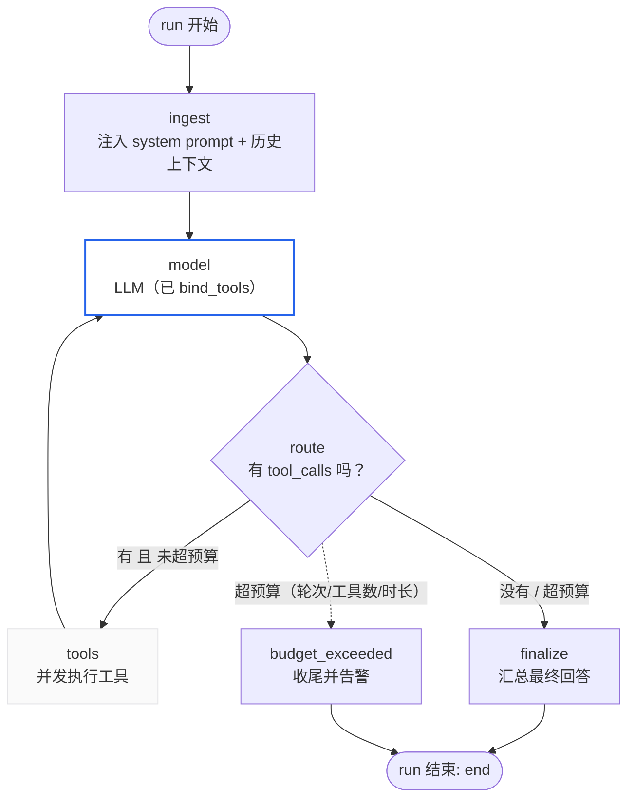
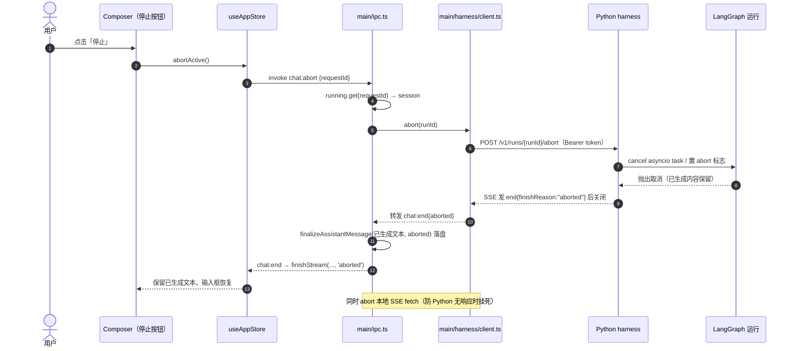
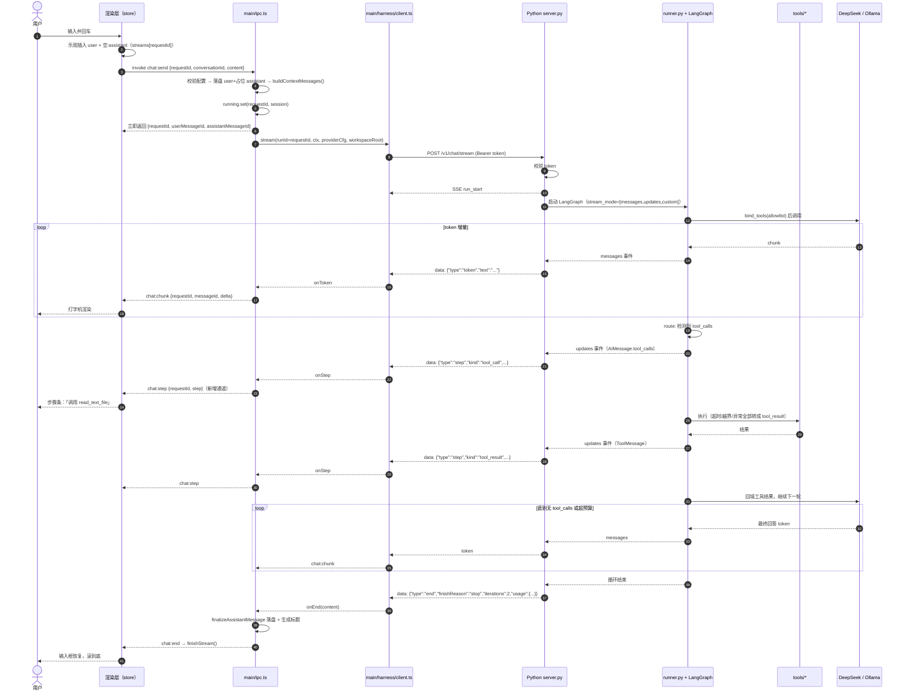
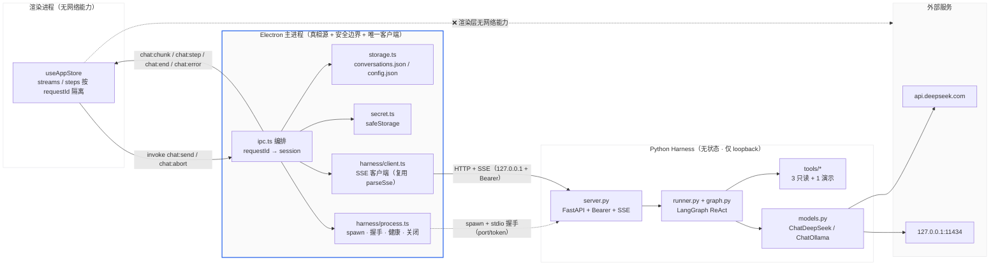

# mini-agent Agent Harness 架构设计

> 版本：v1.0（设计稿，**待用户确认后才进实现**） ｜ 作者：高见远（架构师）
> 设计对象：在现有 Electron 客户端之下，新增一层用 Python 编写的 **Agent Harness**（编排层）
> 本文只做设计，不含业务代码。按项目规定，本文不含任何需要执行命令的验证步骤。

---

## 0. 结论速览（先看这一页）

| # | 议题 | 明确结论 | 备选（已否决） |
|---|---|---|---|
| 1 | 进程与通信 | **Electron main 拉起本地 FastAPI 子进程；HTTP + SSE；绑定 `127.0.0.1` + 端口 0（随机）+ 一次性 Bearer token；token 与端口经 stdio 握手回传，渲染层永远不知道** | stdio JSON-RPC（否决：streaming 多路复用与调试成本高）、WebSocket（否决：本项目无需双向，SSE 足够） |
| 2 | 框架 | **LangGraph 1.x（LTS）+ 预置 ReAct agent**；配一层自研 `HarnessBackend` 接口隔离，保留换手写循环的可能 | 手写 ReAct 循环（否决：MVP 后维护成本失控）、LangChain `AgentExecutor` 老式 agent（已被 LangGraph 取代） |
| 3 | Agent 循环 | `ingest → model(带工具) → 条件路由 → tools → model ... → finalize`；**上限 5 轮 / 8 次工具调用 / 120s** | 多 agent / planner-critic（推迟） |
| 4 | 工具系统 | 装饰器注册 + 显式白名单 profile；**MVP 只给 3 个只读工具 + 1 个演示工具**，写文件/执行命令**不进 MVP** | 全量工具 + 审批中断（Phase 2） |
| 5 | 状态与记忆 | **`conversations.json` 仍是唯一真相源，Python 不做持久化会话**；Python 只持内存态（InMemorySaver）+ 可选 append-only 调试日志 | 引入 SQLite 存会话（否决：两套真相） |
| 6 | 流式契约 | harness 出 **SSE，每帧一个 JSON 事件**；主进程复用现有 `parseSse` 翻译成既有 `chat:chunk/end/error`，**新增 `chat:step` 承载工具步骤** | 裸 NDJSON（否决：无框架保证、难肉眼调试） |
| 7 | 打包 | 开发期用户自装 Python（推荐 `uv`）；出 .exe 时用 **PyInstaller onedir** 分包，作为独立里程碑。**这是本项目最大复杂度来源** | 一步到位打包（否决：会把 MVP 卡死） |
| 8 | 启动与密钥 | `pnpm dev` 不变，主进程在 dev 下**自动 spawn** harness；**Key 由主进程按请求下发（复用 safeStorage），Python 不读 .env、不落盘** | harness 读环境变量（否决：两处密钥来源） |
| 9 | MVP 边界 | 见 §9：约 15 个 Python 文件 + 主进程 3 个新文件；能跑通「问答 / 单工具调用 / 多轮工具 / 停止」 | 完整 LangGraph 状态机（推迟） |
| 10 | 开放决策 | 见 §11，共 8 条，需用户拍板 | — |

**一句话架构**：Electron 仍是唯一的「真相持有者与安全边界」；Python 退化为一个**无状态、被动的编排执行器**——主进程把「上下文 + 配置 + Key + 工作目录」一起 POST 进去，Python 用 SSE 把「token 与工具步骤」吐回来。这样既拿到了 agent 能力，又**不破坏现有安全基线（CSP 里 `connect-src 'none'` 可以原样保留）**。

---

## 1. 进程与通信模型

### 1.1 推荐方案

```
┌─────────────────── Electron 主进程（唯一的安全边界与客户端） ───────────────────┐
│                                                                                │
│  ① child_process.spawn('python', ['-m','mini_agent_harness'])                   │
│     env: MINI_AGENT_HARNESS=1, 不出网；cwd = <repo>/harness                      │
│     stdio: ['ignore','pipe','pipe']                                             │
│                                                                                │
│  ② 子进程就绪后向 stdout 打印**唯一一行**握手 JSON：                              │
│     {"event":"ready","port":51423,"token":"<32字节随机>","pid":1234,"version":"0.1.0"} │
│     主进程读到后：记住 port+token（仅内存），后续 stdout 只当日志                 │
│                                                                                │
│  ③ 主进程是 harness 的唯一 HTTP 客户端：                                         │
│     POST http://127.0.0.1:<port>/v1/chat/stream   Authorization: Bearer <token>  │
│     POST http://127.0.0.1:<port>/v1/runs/{runId}/abort                          │
│     GET  http://127.0.0.1:<port>/v1/health                                      │
│                                                                                │
│  ④ 应用退出：优雅关闭（POST /v1/shutdown）→ 2s 后仍未退出则 kill 进程树          │
└────────────────────────────────────────────────────────────────────────────────┘
        ▲ ipcMain/webContents.send（既有通道，语义不变）
        │
┌───────┴──────────┐        ┌──────────────────────────────┐
│ preload（白名单） │        │ 渲染进程（CSP: connect-src 'none'）│
└──────────────────┘        └──────────────────────────────┘

        │ HTTP/SSE（仅 127.0.0.1，非 loopback 不可达）
        ▼
┌──────────── Python Harness 子进程（agent 编排，无状态） ────────────┐
│  FastAPI + uvicorn  ·  绑定 host=127.0.0.1, port=0（内核分配随机端口）│
│  仅接受带 token 的请求；无 CORS 中间件（不存在浏览器客户端）          │
│  每请求校验 token → 构建模型 → 跑 LangGraph → 以 SSE 回吐事件        │
└──────────────────────────────────────────────────────────────────────┘
```

### 1.2 为什么是「本地 HTTP + SSE」，而不是另外两个

| 维度 | 本地 HTTP + SSE ✅ | stdio JSON-RPC | 本地 WebSocket |
|---|---|---|---|
| 流式多路复用 | 天然（每请求一条 SSE 连接，`runId` 隔离） | 需自造帧协议与多路复用 ID 表 | 天然 |
| 与 LangGraph 的契合度 | 高（异步生成器 → SSE 逐帧吐，几乎零胶水） | 中（要在线程/事件循环里包一层写 stdout） | 高 |
| 调试体验 | 好（`curl -N` 直接看事件流；日志与协议分流互不污染） | 差（stdout 既是日志又是协议，`print` 一句就毁协议） | 中（需要 WS 客户端） |
| 崩溃/半包恢复 | 好（HTTP 层有明确生命周期） | 差（父子进程共享管道，一方卡死难判责） | 中 |
| 安全面 | 可接受（loopback + 随机端口 + 一次性 token） | 最优（根本没有端口） | 同 HTTP |
| 未来扩展 | 好（可独立运行、被其它 UI 复用、可接 curl/测试脚本） | 差 | 中 |
| 实现复杂度 | 低（FastAPI 十几行起服务） | 中高 | 中 |

**关键理由**：stdio 的唯一优势是「没有端口」，而我们可以用 `127.0.0.1 + 随机端口 + 一次性 Bearer token + 不注册任何对外监听` 把端口风险压到与 stdio 同量级；反过来 stdio 的代价（自造帧协议、日志污染、调试困难）是**持续性成本**，会一直拖累迭代。WebSocket 则是纯粹的过度设计——我们需要的是「一次请求、一串响应」，正是 SSE 的形状。

### 1.3 三条不可妥协的安全约定

1. **渲染层永远不碰 harness**：端口与 token 只存在于主进程内存，preload 不暴露任何新方法给渲染层去直连 Python。现有 CSP `connect-src 'none'` **原样保留**，这就是「渲染层不能直连云」的架构约束在新架构下依然成立。
2. **绑定不可放宽**：`host="127.0.0.1"` 硬编码（不是 `0.0.0.0`、不由配置覆盖），端口用 `0` 让内核分配，避免端口冲突与固定端口被本机其它进程探测。
3. **token 是一次性会话凭据**：每次 spawn 重新生成（`secrets.token_urlsafe(32)`），仅通过 stdio 握手传递，绝不出现在命令行参数（`ps` 可见）、绝不出现在日志、绝不出现在任何配置文件。Python 侧对不带/带错 token 的请求一律返回 401 且不透露任何细节。

> 补充：Python 侧加一个「父进程看门狗」——定时检查 `os.getppid()` 是否变化/父进程是否存活，父进程消失则自退，防止 Electron 崩溃后残留孤儿进程占端口。

---

## 2. 框架选型

### 2.1 结论

**选 LangGraph 1.x（LTS）+ 其预置 ReAct agent，外面包一层自研的 `HarnessBackend` 接口。**

三层结构：

```
server.py          ← 只做 HTTP/SSE 与鉴权
   └─ runner.py    ← 把 LangGraph 的异步事件流翻译成我们的协议事件（token/step/end/error）
        └─ graph.py + backend.py
             ├─ LangGraphBackend   ← 默认实现：LangGraph 预置 ReAct 循环
             └─ (预留) RawLoopBackend ← 手写循环的逃生舱
```

`HarnessBackend` 的接口形状（**只有 3 个方法，刻意做窄，避免被 LangChain 的 API 形态绑架**）：

```python
class HarnessBackend(Protocol):
    def run(self, req: RunRequest, emit: EventSink) -> AsyncIterator[HarnessEvent]:
        """跑一轮 agent，边跑边 emit；返回终态。"""
    def abort(self, run_id: str) -> None: ...
    async def aclose(self) -> None: ...
```

### 2.2 三方对比

| 方案 | 优点 | 缺点 | 结论 |
|---|---|---|---|
| **LangGraph 1.x** | ① 状态机 + 条件边，循环/路由/上限都是一等公民，正好是我们的需求形状；② 内置流式模式天然区分「token 增量」与「节点级中间步骤」，**一项就省掉我们最重的自研工作量**；③ `interrupt()` 为 Phase 2 的「危险操作人工审批」预留了正规出口；④ Checkpointer 抽象让我们后面能用 SQLite 做「崩溃续跑」而不改业务代码；⑤ 预置 ReAct agent 已建立在 LangGraph 上，等于「上手即用、且能长成复杂拓扑」 | ① 依赖体积大（langchain + langgraph + pydantic + httpx 等）；② API 演进快（0.x → 1.x 有破坏性变更），必须锁版本；③ 抽象层多，出问题要看它的源码 | ✅ **选定** |
| LangChain 老式 `AgentExecutor` | 概念最少 | 官方已把 agent 能力迁到 LangGraph，`create_react_agent` 本身就是 LangGraph 图；继续用等于站在弃用路径上 | ❌ |
| 手写 ReAct 循环 | 零框架依赖、完全可控、体积小 | 要自己处理：工具 schema 生成、多工具并行调用、DeepSeek 与 Ollama 的 tool-call 差异、消息累积与去重、迭代上限、流式增量与工具步骤的区分、后续还要加审批/续跑——**估算 300+ 行且持续增长**，正好落在「MVP 看起来最省、三个月后最贵」的陷阱里 | ❌ |

### 2.3 同时支持 DeepSeek 与 Ollama

沿用现有的「Provider 工厂」思路，Python 侧只暴露一个函数：

```python
# models.py
def build_chat_model(provider: Literal["deepseek", "ollama"], cfg: ProviderConfig) -> BaseChatModel:
    if provider == "deepseek":
        return ChatDeepSeek(model=cfg.model, api_key=cfg.api_key,
                            api_base=cfg.base_url, timeout=cfg.timeout_s, max_retries=1)
    return ChatOllama(model=cfg.model, base_url=cfg.base_url,
                      client_kwargs={"timeout": cfg.timeout_s})
```

要点：

- **复用用户已有的 baseUrl / apiKey / model**，不新建一套配置，用户在设置页改了什么，harness 立刻跟着变（因为配置是**每请求下发**的）。
- 依赖包：`langchain-deepseek`（`ChatDeepSeek`）、`langchain-ollama`（`ChatOllama`）、`langchain-core`、`langgraph`。DeepSeek 也完全可以用 `ChatOpenAI(base_url=...)` 兜底（官方 OpenAI 兼容），保留为降级选项。
- ⚠️ **重要事实（必须让用户知道）**：`deepseek-reasoner` 类推理模型**不支持 tool calling**；能跑工具调用的必须是对话类模型。官方文档同时显示 `deepseek-chat` / `deepseek-reasoner` 的弃用日期与新模型命名（`deepseek-v4-flash` 支持工具调用、`deepseek-v4-pro` 为推理模型不支持工具调用）。**这不是我能替用户决定的**，已列入 §11 待拍板项 Q1。
- ⚠️ **Ollama 工具能力取决于具体模型**：并非所有本地模型都支持 tool calling。所以「模型不支持工具」必须是一条**可读的中文错误**，而不是静默退化成不调工具（见 §4.4）。

来源：LangChain 官方 DeepSeek 集成文档（`docs.langchain.com/oss/python/integrations/chat/deepseek`）、ChatDeepSeek API reference、LangGraph 1.x LTS 与 streaming 文档。

---

## 3. Agent 循环

### 3.1 图结构（MVP）



MVP **刻意不加** planner / critic / 多 agent 子图——单一 ReAct 循环已能覆盖「问答 + 调用工具 + 多轮工具后作答」三种真实场景。

### 3.2 预算上限（硬编码默认值，全部走 `config.py` 可调）

| 预算 | 默认 | 超限行为 |
|---|---|---|
| 最大迭代轮数（model→tools 循环次数） | 5 | 停止循环，用已达成的文本收尾，`end.finishReason="length"` 并附 `truncated:true` |
| 单轮最大工具调用数 | 8 | 拒绝执行多余工具，回填一条 `tool_result{ok:false}` 让模型自己收敛 |
| 单次工具超时 | 10s | 工具返回超时错误，循环继续（不让工具异常打断 agent） |
| 单次模型调用超时 | 120s | 整轮报 `error{code:'NETWORK'}` |
| 整轮总预算 | 180s | 强行收尾，`end` 带 `truncated:true` |

> 对应 LangGraph 侧同时设置 `recursion_limit`（防止图自身失控，是预算之外的**第二道保险**）。

### 3.3 流式：同时推「token 增量」与「中间步骤」

LangGraph 的流式模式恰好一一对应我们的两种事件，用**列表同时订阅**：

| LangGraph 流式模式 | 拿到什么 | 映射成我们的协议事件 |
|---|---|---|
| `messages` | 模型逐 token 的 chunk（带 metadata 可判断来自哪个节点） | `token` → 既有 IPC `chat:chunk` |
| `updates` | 每个节点完成后的状态增量（含 `AIMessage.tool_calls`、`ToolMessage`） | `step`（tool_call / tool_result）→ 新增 IPC `chat:step` |
| `custom` | 节点内自行 `writer(...)` 写出的自定义进度 | `step`（progress / notice） |
| （我们自己加） | 终态、用量、迭代次数 | `end` / `error` |

关键实现约束（写进代码注释，避免后续踩坑）：

1. **只把「来自 model 节点」的 messages 当 token 推**，否则工具节点的内部消息会漏进正文。
2. `updates` 模式下，一个 `AIMessage` 若带 `tool_calls`，它可能同时携带「模型在调工具前说的话」——这段文本要作为 `assistant_text`/token 正常推给用户（否则用户会觉得模型沉默了一轮）。
3. **工具参数与结果都要做截断后再外发**（args ≤ 2KB、结果 preview ≤ 500 字），否则读大文件时会把 IPC 和 UI 一起打爆。
4. 事件必须**在产生的瞬间**外发（不能先攒完整个数组），否则流式退化为一次性返回。
5. 每个事件都带 `runId`，取消时按 `runId` 精确切断。

---

## 4. 工具系统

### 4.1 注册机制

- 工具用 LangChain 的 `@tool` 装饰器定义：**函数类型注解 + docstring 自动生成 JSON Schema**，不手写 schema（手写就会漂移）。
- `tools/registry.py` 维护一个显式表：`TOOLS: dict[str, ToolSpec]`，`ToolSpec` 含 `name / tool / profiles / danger / timeout_s`。
- **profile 是白名单**：`PROFILE_TOOLS = {"safe": [...], "dev": [...]}`，默认 `safe`。注册表是唯一的启用开关，**模型无法自行启用未注册的工具**（工具集在构造时就 `bind_tools(allowlist)` 注入，不在运行时动态暴露）。
- 每个工具外层套一层统一包装：超时、异常转 `ToolMessage(status="error")`、入参再次校验、耗时统计、日志掩码。**任何工具异常都不允许冒泡打断 agent 循环**（这是 agent 系统最常见的崩溃源）。

### 4.2 MVP 工具集（3 + 1）

| 工具 | 签名（示意） | profile | 危险级 | 说明 |
|---|---|---|---|---|
| `list_directory` | `(path: str = ".") -> str` | safe | 无 | 列出目录（名称/类型/大小/修改时间），限制条目数 |
| `read_text_file` | `(path: str, max_bytes: int = 65536) -> str` | safe | 无 | 读文本，超限截断并明确标注「已截断」 |
| `search_text` | `(pattern: str, path: str = ".", glob: str = "**/*") -> str` | safe | 无 | 文本检索（返回 file:line: 摘要），限结果条数 |
| `get_current_time` | `() -> str` | safe | 无 | 演示/连通性工具：让「零风险地看到工具调用链路」在 UI 上可视化 |

选这套的理由：**三个只读工具足以覆盖「读代码、看目录、找符号」这个最有说服力的 demo 场景**，同时把「破坏性操作」的安全问题整体推迟，让 MVP 不背上审批流程的复杂度。

### 4.3 安全边界（Windows 优先）

| 边界 | 规则 |
|---|---|
| **根目录围栏** | 所有路径先 `Path.resolve()`，再校验 `is_relative_to(WORKSPACE_ROOT)`；`WORKSPACE_ROOT` 由主进程每请求下发，默认 `<userData>/workspace` |
| **软链接逃逸** | 解析后用 `os.path.realpath` 再校验一次（Windows 上还要注意 junction），防 `subst`/软链绕过 |
| **拒绝清单** | 路径片段命中即拒绝：`.ssh` `.aws` `.gnupg` `AppData` `Windows` `System32` `Program Files` `.env` `id_rsa` `*.pem` `*.key` `credentials` `NTUSER.DAT` 等 |
| **规模上限** | 单次读 64KB、单次结果 8 条/500 字 preview、单目录 200 条 |
| **不做的事** | MVP **不提供**：写文件、删文件、改权限、`shell` 执行、网络访问、进程启动、注册表操作 |
| **执行方式** | 不用 `shell=True`、不用 `os.system`、不做字符串拼命令（即便 Phase 2 加 exec，也必须是参数数组 + 命令白名单） |
| **越界反馈** | 越界不抛裸异常，返回中文拒绝理由（如「路径超出允许的工作目录」），并 emit 一个 `step{kind:"tool_denied"}` 让 UI 可见——**安全策略必须可见，不能静默** |

### 4.4 「模型不支持工具调用」的处理

在 `ingest` 前做一次能力探测：请求里带 `toolsEnabled` 与 `model`，后端在**首次**拿到「模型无视工具/返回不支持」的响应时，按以下顺序处理：

1. 若模型不支持工具 → 立刻 emit `step{kind:"notice", text:"当前模型不支持工具调用，已按普通对话模式继续"}`，并以 `tools=[]` 重跑本轮（**不报错**，用户仍能得到回答）；
2. 同时 emit 一条可读提示，引导用户切换到支持工具调用的模型；
3. 该判定结果按 `(provider, model)` 缓存在 harness 进程内存，避免每轮重复试错。

---

## 5. 状态与记忆

### 5.1 核心原则：单一真相源

> **会话历史的唯一真相源仍然是 Electron 的 `userData/conversations.json`。Python 侧不建立任何会话数据库。**

理由：现在这套「`conversations.json` + `config.json` 物理分离 + 原子写 + 串行 mutate」已经跑通并被验证（见 `src/main/storage.ts`）。如果 Python 再存一份会话，立刻产生三个真实问题：两边消息 id 不一致、前端乐观插入与后端重试的幂等冲突、删除会话要跨进程同步。「不要搞出两套真相」——这一条是硬设计约束。

### 5.2 存储分工表

| 数据 | 存放位置 | 写入者 | 生命周期 | 是否真相源 |
|---|---|---|---|---|
| 会话列表 + 消息全文 | `userData/conversations.json` | **Electron 主进程唯一写** | 永久 | ✅ 是 |
| Provider 配置 + API Key 密文 | `userData/config.json`（safeStorage） | Electron 主进程 | 永久 | ✅ 是 |
| 本轮 agent 运行态（消息列表、工具中间结果、迭代计数） | **Python 进程内存**（LangGraph 状态 + `InMemorySaver`） | harness | 单轮（run 结束即释放） | ❌ 否 |
| harness 运行轨迹（调试用） | `userData/harness/runs/<runId>.jsonl`（append-only，可选，默认关） | harness | 保留 7 天/最多 200 轮，自动清理 | ❌ **否**，仅供排障 |
| harness 进程日志 | `userData/harness/logs/harness.log`（滚动，Key 掩码） | harness | 保留 3 个文件 | ❌ 否 |

**关键约定**：`runs/*.jsonl` 与日志**永远不被读回来驱动业务逻辑**，删掉它们不影响任何功能。这样它就不会演变成第二套真相。

### 5.3 上下文与记忆的分层

| 层 | MVP 做法 | 后续 |
|---|---|---|
| **Short-term（本轮）** | harness 每请求收全量 `messages`（由主进程按现有规则裁剪）——**与今天的直连模式完全一致**，harness 是 `provider.chatStream` 的等价替换 | — |
| **对话记忆** | 沿用现有「最近 N 条」上下文策略（`CONTEXT_MESSAGE_LIMIT`），不引入向量库 | 摘要压缩 / 长期记忆 Store（跨会话） |
| **检查点（崩溃续跑）** | `InMemorySaver`（进程内，够用） | `SqliteSaver` 落在 `userData/harness/checkpoints.db`，**只存运行态、不存会话**，支持长任务跨重启续跑 |
| **工具观感** | 工具结果只进本轮上下文，不回写会话（会话里只保留最终回答） | Phase 3 可在 `Message.meta.steps` 里存步骤摘要供回看 |

**注意上下文裁剪责任的归属**：仍由**主进程**负责（`buildContextMessages` 已实现），harness 只做「收到的就是全部上下文」。这样裁剪策略只有一处定义，且与直连模式行为一致——**回退开关打开时行为不变**，这很重要。

---

## 6. 流式契约

### 6.1 harness 侧：SSE（每帧一个 JSON 事件）

```
POST /v1/chat/stream
Authorization: Bearer <token>
Content-Type: application/json

{
  "runId": "...",                       // 由主进程生成（沿用现有 requestId 生成器）
  "conversationId": "...",
  "provider": "deepseek" | "ollama",
  "model": "deepseek-chat",
  "baseUrl": "https://api.deepseek.com",
  "apiKey": "sk-...",                   // ← 仅内存、仅本请求，禁止日志
  "messages": [{"role":"user","content":"..."}, ...],
  "workspaceRoot": "C:\\...\\workspace",
  "limits": {"maxIterations":5, "maxToolCalls":8, "toolTimeoutMs":10000, "totalTimeoutMs":180000}
}
```

响应：`Content-Type: text/event-stream`，每帧 `data: {json}\n\n`，**15s 一次 `: ping` 心跳**，**必定以 `end` 或 `error` 收尾**（这是客户端能安全退出 loading 的唯一保证）。

事件全量（协议 v1）：

| type | 字段 | 何时发 |
|---|---|---|
| `run_start` | `runId, conversationId, provider, model, tools[]` | 请求被接受后第一帧 |
| `token` | `text` | 模型输出的每个增量片段 |
| `step` | `stepId, iteration, kind, tool?, args?, ok?, preview?, durationMs?, text?` | 工具调用/结果/提示（`kind ∈ tool_call / tool_result / tool_denied / notice`） |
| `end` | `finishReason: stop\|length\|aborted\|error, iterations, usage{inputTokens,outputTokens}, truncated?` | 正常或中止收尾 |
| `error` | `code: <ErrorCode>, detail?` | 异常收尾（此后不再有帧） |

```jsonc
// step 示例
{"type":"step","stepId":"s1","iteration":1,"kind":"tool_call","tool":"read_text_file","args":{"path":"src/index.ts","max_bytes":4096}}
{"type":"step","stepId":"s1","iteration":1,"kind":"tool_result","tool":"read_text_file","ok":true,"preview":"import ...","durationMs":12}
```

### 6.2 与现有 IPC 的映射（**这是全篇最关键的一张表**）

| harness 事件 | 主进程动作 | IPC 通道 | 渲染层（`useAppStore`） |
|---|---|---|---|
| `run_start` | 记日志；不做 UI 动作 | — | — |
| `token` | 直接转发 | `chat:chunk`（**语义完全不变**） | `appendDelta(requestId, delta)`（**零改动**） |
| `step` | 转发，并做 `messageId` 补齐 | **`chat:step`（新增）** | 新增 `steps: Record<requestId, Step[]>`（**纯增量**） |
| `end` | 把全文落盘（沿用 `finalizeAssistantMessage`） | `chat:end`（语义不变） | `finishStream(...)`（**零改动**） |
| `error` | 落盘错误标记 | `chat:error`（语义不变） | `failStream(...)`（**零改动**） |

**结论：现有 `chat:chunk / chat:end / chat:error` 三个通道与 `requestId` 隔离机制一行都不用改。** 新增能力全部走 `chat:step` 这条新通道，属于向后兼容的纯增量扩展（旧渲染层忽略未知通道即可正常工作）。

### 6.3 与现有 store 的兼容性核对（已实际读过 `useAppStore.ts`）

| 现有机制 | 新架构下是否成立 | 说明 |
|---|---|---|
| `streams[requestId]` 逐 delta 累积 | ✅ 成立 | token 仍按 requestId 到达，`appendDelta` 逻辑不变 |
| `discarded` 丢流（切会话不串流） | ✅ 成立 | 新增的 `steps` **必须遵守同一套 discard/rebind 规则**（同一份 `discardAll/rebindStreams` 逻辑扩展一个字段），否则切会话后步骤会漏到新会话上 |
| `activeRequestId` + 停止按钮 | ✅ 成立 | `chat:abort` 语义不变，主进程多做一步「通知 Python 取消」 |
| 乐观插入 + `remapOptimisticIds` | ✅ 成立 | 权威 id 仍由主进程生成（Python 不参与 id 生成） |
| `isProviderConfigured` 未配置态 | ✅ 成立 | 未配置时**根本不发请求**，与今天一样短路 |
| 错误块与中文文案 | ✅ 成立 | 文案表 `ERROR_TEXT` 仍是唯一来源（见 §6.4） |

### 6.4 错误码与文案的归属（避免中文文案出现两份）

**决定：Python 只回 `code`，中文文案仍由 TS 侧 `ERROR_TEXT` 表生成。**

```
Python 抛异常 → 归类为 ErrorCode → SSE error{code, detail}
                                   ↓
Electron 主进程：ERROR_TEXT[code] 取中文（必要时拼接 provider 的 unreachableHint）
                                   ↓
chat:error{code, message} → 渲染层错误块（零改动）
```

需在 `src/shared/types.ts` **新增两个码**（旧 9 个一律不动，保证不破坏兼容）：

| 新码 | 中文文案 | 触发 |
|---|---|---|
| `HARNESS_UNAVAILABLE` | 本地 agent 服务未启动，请重启应用 | spawn 失败 / health 探测失败 / 连接被拒 |
| `TOOL_DENIED` | 该操作被安全策略拒绝 | 工具路径越界、命中拒绝清单 |
| （可选）`MAX_STEPS` | 已达到最大思考轮数，已返回当前结果 | 预算耗尽（也可复用 `length` + `truncated:true`） |

`ABORTED` 语义保持不变，且**harness 中止也必须走 `end{finishReason:"aborted"}`**（不能发 `error`），否则渲染层会多出一个不该有的红块。

### 6.5 停止（abort）的完整链路



双保险：① HTTP 侧通知 Python 优雅取消；② 主进程自己也 abort 掉那条 fetch（不依赖 Python 一定回包）。两条路都保证「最终只有一条 `chat:end` 落到渲染层」——主进程按 `requestId` 做幂等去重（`running.delete` 返回是否首次）。

### 6.6 全链路时序（一轮带工具调用的完整对话）



---

## 7. 代码布局与打包

### 7.1 Python 代码位置：`mini-agent/harness/`

与 `src/` 平级、**不放 `src/` 里**（因为它是另一个语言/运行时，放进去会污染 TS 的 tsconfig include 与 electron-vite 的构建边界）。

```
mini-agent/
├─ src/                         # 现有 Electron 客户端（改动见 §10）
├─ harness/                     # ★ 新增：Python agent harness
│  ├─ pyproject.toml            # 依赖与入口（推荐 uv；也兼容 pip）
│  ├─ requirements.lock.txt     # 锁定版本（langgraph/langchain 必须锁）
│  ├─ .python-version           # 3.11 / 3.12
│  ├─ README.md                 # 三行启动说明（给用户看）
│  └─ src/mini_agent_harness/
│     ├─ __main__.py            # 入口：解析端口、生成 token、启动 uvicorn、打印握手行
│     ├─ server.py              # FastAPI 路由 + Bearer 校验 + SSE 编码 + 心跳
│     ├─ protocol.py            # Pydantic 事件模型（协议 v1 的唯一定义源）
│     ├─ config.py              # 请求级配置（含 apiKey）——不落盘、不读 .env
│     ├─ backend.py             # HarnessBackend 接口 + LangGraphBackend 实现
│     ├─ graph.py               # StateGraph 组装（ingest/model/route/tools/finalize）
│     ├─ state.py               # AgentState TypedDict + checkpointer 选择
│     ├─ runner.py              # astream → 协议事件 翻译器（含 messages 过滤、截断）
│     ├─ models.py              # build_chat_model(provider, cfg)
│     ├─ errors.py              # 异常 → ErrorCode 归类
│     ├─ safety.py              # 路径围栏 / 拒绝清单 / 上限
│     ├─ logging.py             # 滚动日志 + Key 掩码
│     └─ tools/
│        ├─ registry.py         # 注册表 + profile 白名单 + 统一包装（超时/异常）
│        ├─ fs_tools.py         # list_directory / read_text_file / search_text
│        └─ util_tools.py       # get_current_time
└─ docs/
   └─ HARNESS-ARCHITECTURE.md   # 本文
```

Python 侧约 **15 个文件**（未含 `__init__.py` 与 tests），与「最小可用」的目标一致。

### 7.2 打包复杂度 —— 如实说明

> **这是整个项目最大的复杂度来源，我必须直说：把 Python 塞进 Electron 安装包，是这类项目最容易在「看起来快好了」的时候翻车的地方。**

**开发期（MVP）**：用户本机已有 Python 3.11/3.12（或装 `uv`）。harness 以源码形式运行，**不打包**，零打包成本。

**出 .exe 时**，三档方案：

| 方案 | 用户需要做什么 | 包体增量 | 复杂度 | 主要坑 |
|---|---|---|---|---|
| **A. 要求用户自装 Python**（MVP 推荐） | 装 Python + 按 README 装依赖（或一条 `uv sync`） | 0 | ★ | 用户要会敲命令；Python 版本/依赖不一致时要排障 |
| **B. PyInstaller `onedir` 分包**（推荐用于正式发布） | 什么都不用做 | **约 +80～180MB**（Python 运行时 + langchain/langgraph/pydantic/httpx 等） | ★★★★ | ① pydantic v2 编译扩展依赖必须显式 `hiddenimports`/`collect_all`；② uvicorn 的 `--reload` 类动态导入要 hook；③ `onefile` 每次启动解压到临时目录，**启动慢且极易被 Windows Defender/杀软误报**，所以**必须选 `onedir`**；④ 构建产物体积/时间都显著上升；⑤ 打包后不能用源码调试，问题定位成本高 |
| **C. 用户自装 Python + 预置 venv 压缩包** | 装 Python，解压我们发的一个 venv | 约 +60～150MB | ★★ | CUDA/torch 类包会让体积失控（我们不用，可控）；venv 不可移植的坑（路径写死）需 `--copies` 并处理 |

**建议路线**：MVP = 方案 A；等 harness 行为稳定、接口冻结后再做一次方案 B，作为**独立里程碑**（且届时用 `electron-builder` 的 `extraResources` 把 `onedir` 目录塞进安装包，主进程按「打包态用 exe、开发态用 python」二选一挑选可执行文件路径）。

**版本探测（必须实现）**：主进程按顺序尝试 `MINI_AGENT_PYTHON` 环境变量 → `harness/.venv/Scripts/python.exe` → `uv run python` → `python` → `py -3` → `python3`，全部失败则**不阻塞 UI**，退到直连模式并给出可读提示（§9 的降级路径）。

---

## 8. 开发期启动与密钥

### 8.1 与 `pnpm dev` 的协同

| 阶段 | 做法 |
|---|---|
| MVP 开发期 | `pnpm dev` 只起 Electron（**不改现有脚本行为**）。主进程在 `app.isPackaged === false` 且 `HARNESS_ENABLED=1` 时**自动 spawn** harness；`HARNESS_ENABLED` 默认值建议在 dev 下为 `1` |
| 独立调试 harness | 提供 `pnpm harness:dev`（内容形如 `cd harness && uv run python -m mini_agent_harness --standalone-port 8787`）——**仅供开发者手动起**，`--standalone-port` 会打印 token 到控制台方便 curl 调试 |
| 打包态 | 只允许随应用启动，**不提供对外监听端口** |

**生命周期细节（必须实现，否则一定会遇到孤儿进程）**：

- 主进程持有 `child` 引用；`app.on('will-quit')` → 先 `POST /v1/shutdown`，2s 超时后 `child.kill()`。
- 启动即 `stdio: ['ignore','pipe','pipe']`，stdout 只用于握手行 + 转发成主进程日志（**区分「握手行」与「后续日志」，第一行 JSON 解析成功后其余全部当纯文本**）。
- 子进程就绪超时 **8s**（首次 import langchain 可能较慢，dev 下可放宽到 15s）→ 超时按 `HARNESS_UNAVAILABLE` 处理。
- 健康检查：每 30s `GET /v1/health`；连续 2 次失败 → 标记不健康、标记当前 run 失败（`HARNESS_UNAVAILABLE`），**不自动重启**（避免重启风暴），改为在 UI 给一个「重启 agent 服务」的手动按钮（Phase 2）。
- 崩溃日志：子进程 stderr 全量写入 `userData/harness/logs/harness.log`；UI 只显示一句可读提示 + 「查看日志」入口（不显示堆栈）。

### 8.2 密钥处理（明确结论）

> **结论：复用现有 safeStorage，Key 由主进程按请求下发；harness 不读 .env、不读环境变量、不落盘。**

理由链：

1. 现有 `src/main/secret.ts` 已经用系统级凭据加密（safeStorage）实现，并且有「不可用时不降级明文、仅内存持有」的安全底线——**这是已经验证过的最佳落点，不应再引入第二处密钥存储**。
2. 如果让 harness 读环境变量，就会产生第二个真相源：用户在设置页改了 Key，harness 还用着旧的 $_ENV$，表现为「设置页显示已配置但 agent 报鉴权失败」——这正是现有 `hasSecret()` 的注释里明确要避免的那类自相矛盾。
3. 每请求下发的 Key 生命周期最短：只在一次 HTTP 请求的内存里存在，进程重启自然消失，无需清理。

配套硬约束（写成代码约定）：

- `config.py` 里的 `apiKey` 字段标注为 `SecretStr`；`repr`/日志中自动掩码。
- 日志模块统一过一道掩码正则（`sk-[A-Za-z0-9]{6,}`、`Bearer ...`），**任何日志写入前都掩码**。
- 禁止 `print(request.json())` 这类整包打印（协议帧日志只允许打印 `type` 与 `runId`）。
- **逃生口（默认关）**：若开发者想脱离 Electron 单独调试，可显式设 `MINI_AGENT_ALLOW_ENV_KEY=1` 才允许读 `DEEPSEEK_API_KEY`。默认关闭，且 `--standalone-port` 模式下打印醒目警告。

---

## 9. MVP 范围 vs 后续

### 9.1 MVP（本次要做的）

**必须达到的能力（可肉眼验证）**

1. 起着一个 Python harness 子进程，主进程能健康探测到它；
2. 普通问答：token 流式打字机效果与现在**体感一致**；
3. 单工具调用：问「帮我看看 workspace 下有哪些文件」，UI 能看到「调用 list_directory」步骤条并得到最终回答；
4. 多轮工具：连续两次工具调用后作答；
5. 停止：点停止立刻中断（工具执行中也能中断）；
6. 降级：把 harness 关掉（或 spawn 失败），应用**仍然可用**（退到直连模式），只是没有 agent 能力；
7. 错误可读：越界路径 / 模型不支持工具 / harness 未启动，三种情况都有中文提示、不白屏、不卡 loading。

**MVP 明确不做**：写文件与执行命令、人工审批（interrupt）、planner/critic/多 agent、MCP、向量记忆、SQLite 检查点、token 成本 UI、harness 打包成 exe、多窗口、云端。

### 9.2 后续路线（按价值排序，不含承诺日期）

| 阶段 | 内容 | 主要新增复杂度 |
|---|---|---|
| Phase 2 | 写文件 / 执行白名单命令，配 `interrupt()` 人工审批 | SSE 需要双向（审批要回传）→ 需新增 `POST /v1/runs/{id}/approve`，UI 需新增确认卡片 |
| Phase 2 | 「重启 agent 服务」按钮 + 运行轨迹查看器（读 `runs/*.jsonl`） | UI 工作量 |
| Phase 3 | `SqliteSaver` 检查点 + 崩溃续跑 | 一个新的持久化介质（但**只存运行态**，不违反单一真相源） |
| Phase 3 | 跨会话长期记忆（Store）+ 上下文摘要压缩 | 引入 embedding/向量存储（体积与成本） |
| Phase 4 | harness 打包 `onedir` 进安装包 | 见 §7.2 的四个坑 |
| Phase 4 | 多 agent / planner-critic / MCP 工具接入 | 状态机真的开始变复杂 |

**演进路径设计意图**：MVP 的图结构虽然只有 5 个节点，但**节点名、状态字段、事件类型都是按最终形态预留的**（`step.kind` 已含 `tool_denied`/`notice`，预算已独立成 `limits` 对象，`HarnessBackend` 已是接口），所以后续是「往图里加节点」，不是「推倒重来」。

---

## 10. 对现有代码的改动清单（文件级）

> 这一节是给工程师范围用的：**改动被刻意压到最小**，核心是「新增一层客户端 + 换掉一个调用点」。

### 10.1 新增文件

| 文件 | 职责 | 估计规模 |
|---|---|---|
| `src/main/harness/process.ts` | spawn / python 探测 / 握手解析 / 健康检查 / 优雅关闭 / 看门狗配合 | ~180 行 |
| `src/main/harness/client.ts` | HTTP+SSE 客户端：`stream()` / `abort()` / `health()`；**复用现有 `parseSse`**（已验证其签名可直接用于任意 SSE 流） | ~150 行 |
| `harness/**`（15 个文件） | 见 §7.1 | ~900 行 |

### 10.2 修改文件（全部是「加」为主，尽量不改既有逻辑）

| 文件 | 改动 | 风险 |
|---|---|---|
| `src/shared/ipc-channels.ts` | 新增通道 `CHAT_STEP: 'chat:step'` + `ChatStepEvent` / `HarnessStepKind` 类型 | 低（纯增量） |
| `src/shared/types.ts` | 新增错误码 `HARNESS_UNAVAILABLE`、`TOOL_DENIED`（+ `ERROR_TEXT` / `ERROR_RETRYABLE` 两处补项） | 低（旧码不动） |
| `src/main/ipc.ts` | `runChatStream` 内部分流：`harnessEnabled ? harnessClient.stream(...) : provider.chatStream(...)`；`handleChatAbort` 追加通知 Python；新增 `CHAT_STEP` 转发 | **中**（要在不破坏既有编排顺序的前提下加分支，见下方红线） |
| `src/main/index.ts` | `app.whenReady` 后按需启动 harness；`will-quit` 优雅关闭 | 低 |
| `src/preload/index.ts` | 新增 `onChatStep` 订阅（沿用现有 `subscribe` 辅助函数） | 低 |
| `src/renderer/lib/api.ts` | 新增 `onChatStep` 封装 | 低 |
| `src/renderer/store/useAppStore.ts` | `steps: Record<string, Step[]>` + 在 `discardAll/rebindStreams/omitStream` 三处**同步扩展**；`MessageBubble`/`MessageList` 增步骤条 | **中**（丢弃逻辑必须同步扩展，否则切会话会串步骤） |
| `package.json` | 新增脚本 `harness:setup` / `harness:dev`；**不改 `dev` 的现有行为** | 低 |
| `electron-builder.yml` | Phase 4 才加 `extraResources` | — |

### 10.3 `ipc.ts` 改动的四条红线

1. **既有编排顺序（1→10 步）一个字都不改**——只把「第 6 步 `provider.chatStream`」替换为「可切换的执行器」。
2. `chat:send` 仍必须**先 return `{requestId, userMessageId, assistantMessageId}` 再异步跑**（否则打字机会被破坏）。
3. 任何异常路径仍必须走到 `chat:end` 或 `chat:error`，`finally` 仍必须 `running.delete(requestId)`——**harness 不可用也必须落在这条规矩里**。
4. 幂等：中止场景下「Python 回包」与「本地 abort」可能都触发收尾，必须保证**只有第一次**产生 `chat:end`。

### 10.4 迁移策略：双模式共存一个版本周期

```
HARNESS_ENABLED = 0 → 完全走今天的直连逻辑（一行不用动）
HARNESS_ENABLED = 1 → harness 执行器
harness 不可用    → 自动落回 0，并在顶栏显示浅黄提示条
```

开关来源优先级：环境变量 `MINI_AGENT_HARNESS` > 配置项（可加到 `config.json` 的 `ui` 段，不进设置页 UI 也行）> 默认值（dev=开、打包=开但失败即降级）。

这样做的好处：**架构可以被独立验证，且任何时刻都能一条命令回到可用状态。** 我不建议在 MVP 阶段就直接删掉直连代码——那是把回退能力提前扔掉。

---

## 11. 需用户拍板的开放决策

> 以下 8 条我**不替用户选**，每条都给出我的推荐与取舍，请用户明确后我再定稿。

| # | 决策 | 选项 | 我的推荐 | 影响面 |
|---|---|---|---|---|
| **Q1** | **DeepSeek 用哪个模型** | (a) 沿用 `deepseek-chat`；(b) 换 `deepseek-v4-flash`（支持工具调用）；(c) 让用户自己在设置页填 | **(b) + 允许手填**：官方文档显示 `deepseek-chat` / `deepseek-reasoner` 有弃用日期，且 `deepseek-reasoner` 类推理模型**不支持工具调用**，而 harness 的核心价值就是工具调用 | harness 能否跑工具、以及 3 个月后是否会突然失效 |
| **Q2** | 工具可访问范围 | (a) 仅 `<userData>/workspace`；(b) 用户自选一个工作目录；(c) 允许读全盘（拒绝清单兜底） | **(b)**：默认给 workspace，(a) 作为默认值的兜底；**明确否决 (c)**（读全盘 = 把用户的私钥/浏览器数据暴露给模型） | 安全边界；(c) 一旦选定，后续很难收回 |
| **Q3** | MVP 是否包含「写文件 / 执行命令」 | (a) 不含（纯只读）；(b) 含，但需人工审批弹窗 | **(a)**：审批链路要求 SSE 变双向 + 新增 UI 确认卡片，会把 MVP 拖长至少一倍 | MVP 工期与风险 |
| **Q4** | Python 运行时怎么处理 | (a) 用户自装 Python（MVP）；(b) 直接做 PyInstaller onedir；(c) 用户自装 + 我们预置 venv | **(a) 现在，(b) 作为独立里程碑**：见 §7.2，打包是 ★★★★ 复杂度，且会把「架构验证」和「打包排障」两个问题缠在一起 | 交付形态与工期 |
| **Q5** | UI 是否要展示「工具步骤」 | (a) 展示步骤条（新增 `chat:step` + 改 store）；(b) 不展示，只流式文本 | **(a)**：只看最终文本时，agent 与普通聊天无法区分，「用户看不出这是 harness」是本次升级最容易被质疑的点 | 渲染层改动量（§10.2 两处中风险改动） |
| **Q6** | 是否确认「本地 HTTP + 一次性 token」方案 | (a) 确认；(b) 改 stdio JSON-RPC | **(a)**：见 §1.2；若选 (b)，§1、§6、§7、§10 需重写 | 全部设计的前提 |
| **Q7** | 是否保留直连模式开关 | (a) 保留一个版本周期；(b) 直接切换、删除直连代码 | **(a)**：保留回退能力，成本几乎为零（一个分支） | 可回退性 |
| **Q8** | harness 是否需要能脱离 Electron 独立运行 | (a) 需要（方便 curl 调试、未来可复用）；(b) 不需要，只服务 Electron | **(a)**：成本仅一个 `--standalone-port` 参数，但大幅提升可调试性 | 调试效率 |

---

## 12. 风险与缓解

| 风险 | 触发迹象 | 缓解 |
|---|---|---|
| **LangChain/LangGraph 版本漂移** | `pip install -U` 后行为变了 | 锁版本（`requirements.lock.txt`）；`HarnessBackend` 接口隔离，最坏情况换手写循环 |
| **打包地狱**（见 §7.2） | 打包产物启动即崩 / 杀软报警 | 推迟到独立里程碑；只做 `onedir`；不引入 torch/transformers 等重依赖 |
| **孤儿进程 / 端口泄漏** | 任务管理器里有残留 python.exe | 父进程看门狗 + will-quit 优雅关闭 + 超时 kill；随机端口避免冲突 |
| **token 流式出现「卡住不动」** | 用户看到「生成中」但没字 | 15s 心跳 + 主进程侧「最后一个事件时间」超时保护（超过 60s 无任何帧 → 判 `NETWORK` 并收尾） |
| **工具结果过大打爆 IPC** | 界面卡顿/内存飙升 | 硬截断（args 2KB / preview 500 字）+ 结果条数上限，在 `runner.py` 统一执行 |
| **模型不按格式调工具**（本地小模型尤其明显） | 输出里出现伪 JSON 工具调用文本 | MVP 接受：检测到伪调用只做提示；不引入「格式修复」的复杂逻辑（那是无底洞） |
| **安全事件**（模型读到用户私密文件并回显） | — | 根目录围栏 + 拒绝清单 + **默认工作目录隔离**；Q2 明确否决「读全盘」 |
| **两套真相**（会话数据） | Python 里的历史与 JSON 里的不一致 | §5.1 已从架构上禁止 Python 持久化会话；`runs/*.jsonl` 明确为只读的调试件 |

---

## 13. 附：一张图看全



---

*本文为设计稿；用户确认 §11 的 8 项决策后，我再产出对应的实施任务分解（`docs/HARNESS-TASKS.md`）。*
