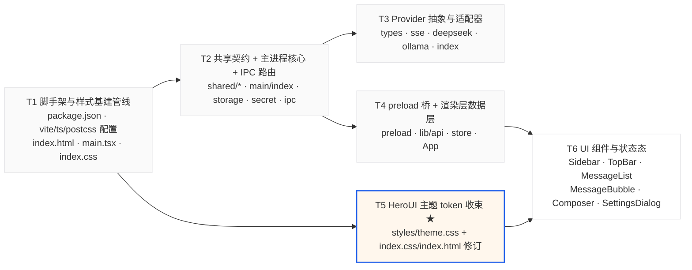

# mini-agent 任务分解与共享约定

> 版本：v1.1（UI 层：HeroUI v3 + Tailwind v4） ｜ 作者：高见远（架构师）
> 配套文档：`docs/ARCHITECTURE.md`（读这份之前先读架构文档）

---

## 0. 给工程师的总纲

1. **严格按 T1 → T6 顺序实现**，每个任务内部的文件一次写完，不要跨任务来回改。
2. **HeroUI 版本与集成方式以 `ARCHITECTURE.md §1.4` 为准**（已核实官方文档），不要凭对 v2 的记忆写 `HeroUIProvider` / `framer-motion` / `tailwind.config.js`。
3. **v3 不需要 Provider**（官方原文：「HeroUI v3 does not require a provider.」）。因此本项目**不写** Provider 包裹；主题锁定靠 `index.html` 根节点属性。
4. 🚫 **禁止执行** lint / 单测 / 编译校验 / 冒烟测试命令，禁止 `npm run build`，禁止启动浏览器截图或 DOM 检查。所有完成判据为静态可核对或用户手动运行肉眼确认。

---

## 1. 依赖包列表

### 1.1 运行时依赖（dependencies）

| 包 | 版本 | 用途 | 理由 |
|---|---|---|---|
| `react` | `^19.0.0` | UI 框架 | **HeroUI v3 要求 React 19+**（官方 Quick Start 明确） |
| `react-dom` | `^19.0.0` | React DOM | 同上 |
| `@heroui/react` | 最新（必要时 `@beta`） | HeroUI v3 组件 | 提供 Select/Modal/Textarea/Input/Button/Alert 的无障碍交互骨架 |
| `@heroui/styles` | 同上 | HeroUI v3 样式与主题变量 | 与 `@heroui/react` 必须成对安装；CSS 侧 `@import "@heroui/styles"` |
| `react-markdown` | `^9.0.0` | Markdown 渲染 | 默认不渲染裸 HTML，零 XSS 面 |
| `remark-gfm` | `^4.0.0` | GFM（列表/表格/删除线） | CH-03 需要列表 |
| `rehype-highlight` | `^7.0.0` | 代码语法高亮 | 配合 highlight.js 主题 CSS，零配置 |
| `highlight.js` | `^11.0.0` | 高亮样式来源 | 只引 `styles/github.min.css`，浅色简约 |
| `zustand` | `^5.0.0` | 状态管理 | 1KB 级；selector 保证流式高频更新只重渲染单条消息 |

### 1.2 开发依赖（devDependencies）

| 包 | 版本 | 用途 | 理由 |
|---|---|---|---|
| `electron` | `^33.0.0` | 桌面运行时 | 主进程 fetch / safeStorage 均可用 |
| `electron-vite` | `^3.0.0` | 三套 Vite 构建（main/preload/renderer） | 开箱即用，目录约定即架构分层 |
| `vite` | `^6.0.0` | 构建底座 | electron-vite 依赖 |
| `@vitejs/plugin-react` | `^4.3.0` | React 插件 | 必需 |
| `typescript` | `^5.6.0` | 类型 | 三端共享类型 |
| `@types/react` | `^19.0.0` | 类型 | 必须跟 React 19 |
| `@types/react-dom` | `^19.0.0` | 类型 | 同上 |
| `@types/node` | `^22.0.0` | 主进程类型 | fs / path |
| `tailwindcss` | `^4.0.0` | **必须 v4** | HeroUI v3 硬约束，v3 会直接出错 |
| `@tailwindcss/postcss` | `^4.0.0` | Tailwind v4 的 PostCSS 插件 | v4 不再用 `autoprefixer`，这一个插件即可 |
| `postcss` | `^8.4.0` | PostCSS 运行时 | 被 `@tailwindcss/postcss` 使用 |
| `electron-builder` | `^25.0.0` | Windows x64 打包 | PA-02（脚本就绪即可，不要求执行） |

### 1.3 明确不安装（违反即返工）

| 包 | 原因 |
|---|---|
| `framer-motion` / `motion` | v3 已改为原生 CSS 动画，官方迁移文档要求**卸载** |
| `@heroui/system`、`@heroui/theme` | v2 遗留包，v3 已废弃 |
| `@mui/*` 及任何 Material 系 | 用户明确禁止 |
| `tailwind.config.js` 相关（`tailwindcss@3`） | v4 不需要 JS 配置文件 |
| `autoprefixer` | Tailwind v4 的 PostCSS 插件已内置 |
| 任何图标库（lucide / iconify / heroicons） | PRD 红线：无图标背景块；用文字或 1px 线性 SVG |
| `uuid` / `nanoid` | 用内置 `crypto.randomUUID()` |
| `axios` | 用主进程内置 `fetch` |
| `next-themes` / 任何深浅色切换库 | 本期只做浅色单主题 |

---

## 2. 任务列表

### 总览

| ID | 任务名 | 涉及文件数 | 前置依赖 | 优先级 |
|---|---|---|---|---|
| T1 | 脚手架与样式基建管线 | 10（含配置） | – | P0 |
| T2 | 共享契约 + 主进程核心 + IPC 路由 | 6 | T1 | P0 |
| T3 | Provider 抽象层与两个适配器 | 5 | T2 | P0 |
| T4 | preload 桥 + 渲染层数据层 | 4 | T2 | P0 |
| T5 | **HeroUI 主题 token 收束** | 3（1 新增 2 修订） | T1 | P0 |
| T6 | UI 组件与全部状态态 | 6 | T4, T5 | P0 |

> T5 必须排在 T6 之前完成：**主题层是所有 UI 组件的依赖**，先写组件再补主题会出现大圆角/彩色按钮返工。

---

### T1 · 脚手架与样式基建管线

| 项 | 内容 |
|---|---|
| **涉及文件** | `package.json`、`electron.vite.config.ts`、`tsconfig.json`、`tsconfig.node.json`、`tsconfig.web.json`、`postcss.config.js`、`electron-builder.yml`、`.gitignore`、`src/renderer/index.html`、`src/renderer/main.tsx`、`src/renderer/index.css` |
| **依赖** | 无 |
| **优先级** | P0 |

**要做什么**
1. `package.json`：按 §1 依赖清单写 dependencies / devDependencies；scripts 至少 `dev`（electron-vite dev）、`build`（electron-vite build + electron-builder，脚本存在即可）。
2. `postcss.config.js`：`export default { plugins: { "@tailwindcss/postcss": {} } }`，**不要** autoprefixer。
3. `electron.vite.config.ts`：main / preload / renderer 三段；renderer 段开启 react 插件（Vite 会自动读 `postcss.config.js`）。
4. `index.html`：`<html lang="zh-CN" class="light" data-theme="light" data-reduce-motion="true">`，body 挂 `#root`，引入 `main.tsx`。
5. `index.css`：只写 `@import` 顺序 + `@import "highlight.js/styles/github.min.css"` + 一句 body 基础排版（背景/文字走变量）。**主题变量不写在这里**（留给 T5）。
6. `main.tsx`：React 19 `createRoot`；**全工程唯一** `import './index.css'` 的位置；先渲染一个占位 `
`。
7. `electron-builder.yml`：win x64 / nsis / 产物目录 / `asar: true`；**不要**配置 CI。

**完成判据（静态可核对）**
- [ ] `package.json` 含 `tailwindcss@^4`、`@tailwindcss/postcss`、`@heroui/react`、`@heroui/styles`、`react@^19`；**不含** framer-motion / MUI / 图标库
- [ ] 仓库根目录**不存在** `tailwind.config.js`
- [ ] `postcss.config.js` 只有一个插件
- [ ] `index.html` 的 `<html>` 同时带 `class="light"`、`data-theme="light"`、`data-reduce-motion="true"`、`lang="zh-CN"`
- [ ] `index.css` 中 `@import "tailwindcss"` 出现在 `@import "@heroui/styles"` 之前
- [ ] `electron.vite.config.ts` 含 main/preload/renderer 三段配置
- [ ] 全工程只有 `main.tsx` 一处 `import './index.css'`

---

### T2 · 共享契约 + 主进程核心 + IPC 路由

| 项 | 内容 |
|---|---|
| **涉及文件** | `src/shared/types.ts`、`src/shared/ipc-channels.ts`、`src/main/index.ts`、`src/main/storage.ts`、`src/main/secret.ts`、`src/main/ipc.ts` |
| **依赖** | T1 |
| **优先级** | P0 |

**要做什么**
1. `shared/types.ts`：按架构 §4.1 写 `Message` / `Conversation` / `AppConfig` / `PublicConfig` / `ModelInfo` / `ErrorCode` / `FinishReason` / `ProviderId`。**不得 import 任何 node/electron 模块**。
2. `shared/ipc-channels.ts`：13 个通道常量 + 全部请求/响应/事件负载类型（架构 §6）。
3. `main/index.ts`：`BrowserWindow` 1100×720 / min 900×600 / 原生标题栏 / `show:false` 等 ready-to-show 再显示；webPreferences = `{ nodeIntegration:false, contextIsolation:true, sandbox:true, preload }`；`app.whenReady` → `ensureDataFiles` → `registerIpcHandlers`；单实例锁。
4. `main/storage.ts`：`userData/conversations.json` 与 `userData/config.json` 分离；读时带内存缓存；写时先写 `${file}.tmp` 再 `fs.renameSync` 原子替换；不存在时写默认结构。
5. `main/secret.ts`：`safeStorage.encryptString` → base64 存；`decryptString(base64)`；`isEncryptionAvailable()` 暴露给渲染层（决定设置页是否出现黄条）。
6. `main/ipc.ts`：注册全部 `ipcMain.handle`；维护 `Map<string, AbortController>`；流式编排：**先返回 requestId，再异步推事件**（不 await 完整响应）；任一异常都必须发 `chat:error` 并清理 Map。

**完成判据（静态可核对）**
- [ ] `main/index.ts` 同时出现 `nodeIntegration: false`、`contextIsolation: true`、`sandbox: true`
- [ ] `storage.ts` 出现临时文件 + `renameSync`（或 `rename`）的原子写实现
- [ ] `secret.ts` 只使用 `safeStorage`，未引入任何第三方加密库
- [ ] `ipc.ts` 中 `chat:send` 的 handler 是「返回 requestId 后异步推送」，不是等完整响应
- [ ] `shared/*.ts` 中零 `import ... from 'electron'` / `'fs'` / `'path'`
- [ ] 通道字符串全部来自 `ipc-channels.ts` 常量，无硬编码字符串

---

### T3 · Provider 抽象层与两个适配器

| 项 | 内容 |
|---|---|
| **涉及文件** | `src/main/providers/types.ts`、`sse.ts`、`deepseek.ts`、`ollama.ts`、`index.ts` |
| **依赖** | T2 |
| **优先级** | P0 |

**要做什么**
1. `types.ts`：`LLMProvider` 接口（`isConfigured` / `listModels` / `chatStream`）、`ProviderConfig`、`StreamCallbacks`、`ProviderError`（带 `code` / `userMessage` / `retryable`）+ ErrorCode → 中文文案映射表（架构 §7.1）。
2. `sse.ts`：两个纯函数 `parseSse(res.body, onDelta, signal)`（按 `\n\n` 切块、`data:` 前缀、`[DONE]` 终止）与 `parseNdjson(...)`（按行 JSON，取 `message.content` / `response`）；必须支持 `AbortSignal`。
3. `deepseek.ts`：OpenAI 兼容 `POST {baseUrl}/chat/completions`，body 含 `stream:true`、`model`、`messages`；Header `Authorization: Bearer ${apiKey}`；`isConfigured = !!apiKey`；`listModels` 返回内置静态常量 `['deepseek-chat','deepseek-reasoner']`。
4. `ollama.ts`：`POST {baseUrl}/api/chat`（NDJSON，`{model, messages, stream:true}`）；`GET {baseUrl}/api/tags`（3s 超时）取模型；`isConfigured = !!model`；ECONNREFUSED → `UNREACHABLE`。
5. `index.ts`：`ProviderRegistry`，`getProvider(id)` 返回单例；**UI 层与 IPC 层不得出现 deepseek/ollama 字样**。

**完成判据（静态可核对）**
- [ ] `fetch(` 只在 `deepseek.ts` 和 `ollama.ts` 中出现（全仓搜索验证）
- [ ] `chatStream` 签名含 `onDelta` 回调与 `signal`
- [ ] HTTP 状态码 401/403→`AUTH`、429→`RATE_LIMIT`、5xx→`SERVER`、ECONNREFUSED→`UNREACHABLE` 的映射齐全
- [ ] 解析逻辑对「一个 chunk 跨多个 UTF-8 字节」做了 `TextDecoder({stream:true})` 处理
- [ ] `index.ts` 之外没有任何文件里出现 `'deepseek'` / `'ollama'` 字面量（除类型定义与配置文件默认值）

---

### T4 · preload 桥 + 渲染层数据层

| 项 | 内容 |
|---|---|
| **涉及文件** | `src/preload/index.ts`、`src/renderer/lib/api.ts`、`src/renderer/store/useAppStore.ts`、`src/renderer/App.tsx` |
| **依赖** | T2 |
| **优先级** | P0 |

**要做什么**
1. `preload/index.ts`：`contextBridge.exposeInMainWorld('api', {...})`；暴露 13 个 invoke 方法 + 3 个事件订阅（`onChatChunk` / `onChatEnd` / `onChatError`，返回 **取消订阅函数**）；**不转发**任何动态通道、不暴露 `ipcRenderer` 本体。
2. `lib/api.ts`：`window.api` 的类型化封装（`declare global { interface Window { api: Api } }`）；`crypto.randomUUID()` 生成 requestId；提供 `sendMessage` 返回 `{requestId}`。
3. `store/useAppStore.ts`：zustand。状态 = `conversations` / `activeId` / `messages` / `streamingText: Record<requestId,string>` / `loading` / `errorInfo` / `config`；动作 = `hydrate` / `newConversation` / `selectConversation` / `sendMessage`（乐观插入 user + 空 assistant）/ `appendDelta` / `finishStream` / `markError` / `abort`。
4. `App.tsx`：三区布局骨架（左 260px `bg-background-secondary` / 右 flex-col：48px 顶栏 + flex-1 消息区 + 输入区）；`useEffect` 里调 `api.getConfig()` + `api.listConversations()` 水合；注册三个事件订阅并在卸载时取消。

**完成判据（静态可核对）**
- [ ] `preload/index.ts` 中 `exposeInMainWorld` 的对象里**没有** `fetch` / `http` / `readFile` 之类方法
- [ ] 事件订阅函数返回 unsubscribe 闭包
- [ ] `api.ts` 中所有通道名 import 自 `shared/ipc-channels.ts`
- [ ] store 中 `sendMessage` 是先乐观插入再调 IPC（用户能立刻看到自己的消息）
- [ ] `appendDelta` 按 `requestId` 写入，切换会话不会串流

---

### T5 · HeroUI 主题 token 收束 ★所有 UI 任务的前置

| 项 | 内容 |
|---|---|
| **涉及文件** | `src/renderer/styles/theme.css`（新增）、`src/renderer/index.css`（修订：追加 import）、`src/renderer/index.html`（修订：核对属性） |
| **依赖** | T1 |
| **优先级** | P0 |

**要做什么**
严格按 `ARCHITECTURE.md §8.2` 的四段结构写 `theme.css`：

1. **① 语义变量覆盖**（`@layer base` 的 `:root, [data-theme="light"]`）：`--background #ffffff`、`--background-secondary #fafafa`、`--foreground #18181b`、`--muted #71717a`、`--surface #ffffff`、`--surface-secondary #f4f4f5`、`--separator/--border #e4e4e7`、`--accent #2563eb`、`--danger #dc2626`、`--danger-soft #fef2f2`、`--warning-soft #fffbeb`、`--field-*` 系列、`--radius-sm 6px`、`--radius-md 8px`、自定义 `--surface-selected #f4f4f5`。**不写 `[data-theme="dark"]` 块**。
2. **② Tailwind 桥接**（`@theme inline`）：把上面变量映射为 `--color-*` / `--radius-*`，供组件用 `bg-surface-secondary`、`text-muted`、`border-line`、`rounded-md` 等类。
3. **③ BEM 全局覆盖**（`@layer components`）：`.button` / `.input__wrapper` / `.textarea__wrapper` 去阴影压圆角；`.modal__content` / `.popover` / `.select__content` 保留唯一一层阴影 `0 4px 12px rgb(0 0 0 / 8%)` 与 8px 圆角；所有变体 `background-image: none`（零渐变）。
4. **④ 动效压制**：只保留自研 `dots`（生成中…）与 `caret`（流式光标）两个 keyframes。
5. 修订 `index.css`：追加 `@import "./styles/theme.css";`（**放在 `@import "@heroui/styles"` 之后**）。
6. 核对 `index.html` 根节点属性齐全。

**完成判据（静态可核对）**
- [ ] `theme.css` 存在且含四段（① 变量 / ② `@theme inline` / ③ `@layer components` BEM / ④ keyframes）
- [ ] 全仓搜索十六进制色值（`/#[0-9A-Fa-f]{6}/`）**只在 `theme.css` 内命中**
- [ ] `theme.css` 中不存在 `[data-theme="dark"]` 定义块
- [ ] 无 `bg-gradient-to`、`rounded-full`、`rounded-xl`、`rounded-2xl`
- [ ] `box-shadow` 只出现在 `.modal__content` / `.popover` / `.select__content` 三处选择器内
- [ ] `index.css` 中 `@import "./styles/theme.css"` 在 `@import "@heroui/styles"` 之后
- [ ] 自研 keyframes 不超过 2 个

---

### T6 · UI 组件与全部状态态

| 项 | 内容 |
|---|---|
| **涉及文件** | `src/renderer/components/Sidebar.tsx`、`TopBar.tsx`、`MessageList.tsx`、`MessageBubble.tsx`、`Composer.tsx`、`SettingsDialog.tsx` |
| **依赖** | T4、T5 |
| **优先级** | P0 |

**要做什么**（组件 ↔ HeroUI 映射见架构 §3.1；写之前先读 `https://heroui.com/en/docs/react/components/{select|modal|textarea|input|button|alert}`）

1. `Sidebar.tsx`：260px、`bg-background-secondary`、`border-line`；HeroUI `Button` 做「新建会话」；列表按 `updatedAt` 倒序；选中态用 `bg-surface-selected`；删除按钮 hover 才出现。
2. `TopBar.tsx`：48px；左会话标题，右 HeroUI `Select`（模型下拉）+ 设置齿轮 `Button`；未配置时 `Select` `isDisabled` 且占位「未配置模型」，下方渲染浅黄提示条（`bg-warning-soft`）引导去设置。
3. `MessageList.tsx`：`flex-1` 可滚动（用 `@heroui/styles` 的 `scrollbar` 工具类）；内容 `max-w-[720px] mx-auto`；空态 = 居中两行文字 + 灰框示例提示条（无插画）；自动滚到底（流式期间用户手动上滚则停止自动滚动）。
4. `MessageBubble.tsx`：用户 = 右对齐 `bg-surface-secondary` 灰块 `rounded-md`；助手 = 左对齐无气泡白底；**内联 Markdown 渲染**（`react-markdown` + `remark-gfm` + `rehype-highlight`）；流式时尾部 `caret` 光标；错误态渲染 `Alert`（`variant="danger"`）+ 「重试」文字按钮；`aborted` 尾部灰字「已停止」。
5. `Composer.tsx`：最大高 160px 自增高 `Textarea`；Enter 发送 / Shift+Enter 换行；`loading` 时禁用输入框并把发送 `Button` 变「停止」（调 `api.chatAbort`）；聚焦边框走 `--field-focus`。
6. `SettingsDialog.tsx`：HeroUI `Modal` 复合结构；DeepSeek 区域（Base URL / 模型 / API Key Password `Input`）与 Ollama 区域（Base URL / 模型，含手填兜底）；保存走 `api.saveConfig`；`safeStorageAvailable === false` 时显示黄条「Key 将不保存」；可发一条测试请求验证连通性。

**完成判据（静态可核对 + 用户手动核对）**
- [ ] 组件中零字面色值、零 `style={{ color }}`，全部走 `theme.css` 暴露的类
- [ ] 交互事件使用 `onPress`（HeroUI 语义）而非 `onClick`
- [ ] `MessageBubble` 中 Markdown 渲染未使用 `dangerouslySetInnerHTML`
- [ ] 空态 / 加载中 / 错误态 / 未配置态四段 JSX 均存在且互不共存
- [ ] 强调色相关类（`bg-accent` / `text-accent`）全仓出现次数 ≤ 6（对应发送按钮、聚焦态、选中态、主链接）
- [ ] 👤 **用户手动核对**：`npm run dev` 后肉眼确认 —— 窗口 1100×720、三区布局、发消息有打字机效果、刷新后历史还在、切模型生效、填 Key 后重启仍在

---

## 3. 任务依赖图

并行建议：T3 与 T4 可在 T2 完成后并行；T5 与 T3/T4 并行；**T6 必须等 T4 与 T5 都完成**。

---

## 4. 共享知识（跨文件约定，必须共同遵守）

### 4.1 IPC 约定

1. 事件名格式 `域:动作`，全小写，冒号分隔；**唯一定义源** `src/shared/ipc-channels.ts`，任何文件不得硬编码通道字符串。
2. 请求/响应/事件的负载类型也全部放在 `ipc-channels.ts`，主/预/渲三方只从它 import。
3. 流式三件套：`chat:chunk`（增量）/ `chat:end`（正常或中止）/ `chat:error`（错误）。三者都带 `requestId`，渲染层按 `requestId` 分派。
4. `invoke` 型通道的 handler 必须返回**可结构化克隆**的纯对象，不返回类实例、函数、`Buffer`。
5. 主进程推事件前必须判 `mainWindow && !mainWindow.isDestroyed()`。

### 4.2 类型复用约定

| 类型 | 定义位置 | 谁可以用 |
|---|---|---|
| `Message` / `Conversation` / `AppConfig` / `PublicConfig` / `ErrorCode` | `src/shared/types.ts` | 主/预/渲 |
| 所有 IPC 负载类型 | `src/shared/ipc-channels.ts` | 主/预/渲 |
| `LLMProvider` / `ProviderConfig` / `ProviderError` | `src/main/providers/types.ts` | **仅主进程** |
| `window.api` 的类型 | `src/renderer/lib/api.ts` | 仅渲染层 |

- `src/shared/**` 是**零依赖区**：不得 import `electron`、`node:*`、`fs`、`path`，也不得 import 任何 UI 库。
- 渲染层**永远拿不到** `apiKeyEnc` 或明文 Key，只有 `hasApiKey: boolean`。

### 4.3 错误处理约定

1. 主进程内一切可预期异常统一抛 `ProviderError(code, userMessage, retryable)`；IPC 边界统一转成 `{ code, message }` 事件，绝不把 stack 抛给渲染层。
2. 错误**只显示在消息区的错误块**，禁止 `dialog.showErrorBox` / `alert` / 系统弹窗；禁止清空上下文（ER-01）。
3. 任一异常路径都必须发一次 `chat:end` 或 `chat:error`，保证 `loading=false`；`finally` 里 `running.delete(requestId)`。
4. 用户主动停止用 `finishReason:'aborted'`，**不算错误**，不显示红块，已生成内容照常落盘。
5. 中文文案统一在 `providers/types.ts` 的映射表里维护，组件里不写死错误文案。

### 4.4 文件读写原子性约定

1. 写文件一律：`writeFileSync(file + '.tmp', data)` → `renameSync(tmp, file)`；绝不直接覆写目标文件。
2. 读取带内存缓存，写后同步更新缓存，**避免流式期间整表重读**。
3. 流式过程中**不逐 token 落盘**；只在 `chat:end`（含 aborted）与 `chat:error` 时落盘一次。
4. `conversations.json` 与 `config.json` **物理分离**：清空会话历史绝不能触碰 `config.json`。

### 4.5 路径与目录约定

| 内容 | 路径 |
|---|---|
| 会话数据 | `app.getPath('userData')/conversations.json` |
| 配置（含加密 Key） | `app.getPath('userData')/config.json` |
| 所有路径拼接 | 一律 `path.join`，禁止字符串拼 `/` 或 `\` |
| 主进程源码 | `src/main/**` |
| preload | `src/preload/index.ts`（**只允许一个文件**） |
| 渲染层源码 | `src/renderer/**` |
| 跨进程共享 | `src/shared/**` |

### 4.6 颜色与样式约定 ★（HeroUI 引入后的新增红线）

1. **唯一色值来源 = `src/renderer/styles/theme.css`**。任何其它文件中出现十六进制色值、RGB 字面量、`style={{ color }}` 均视为违规。
2. 所有颜色必须走**主题 token 变量**或其桥接出来的 Tailwind 类（`bg-surface-secondary` / `text-muted` / `border-line` / `text-fg`），**不得依赖 HeroUI 默认配色**（默认强调色、默认灰阶、默认 danger 都已被覆盖，直接写类名看似能跑但违反收束原则）。
3. 新增一个语义色必须走两步：先在 `theme.css` ① 段加 `--xxx` 变量，再在 ② 段 `@theme inline` 桥接成 `--color-xxx`；**不允许**跳步直接在组件里写 `bg-[#f4f4f5]`。
4. 圆角只用 `rounded-sm`(6px) / `rounded-md`(8px)；阴影只允许出现在弹层三处选择器；**零渐变**。
5. 组件事件用 `onPress`，不用 `onClick`。
6. 需要覆盖 HeroUI 组件外观时，**优先改 `theme.css` ③ 段的 BEM 规则**；只有当样式与单个实例的动态状态强相关时，才允许在组件上用 `className` 追加 Tailwind 类（且只能追加 token 类）。

### 4.7 HeroUI Provider / 主题挂载约定

1. **v3 不需要 Provider** —— 官方明确说明，本项目**不写** `HeroUIProvider` 包裹，`main.tsx` 只 `createRoot(<App/>)`。
2. 若工程师安装到的版本确实导出并要求 `HeroUIProvider`，则**唯一挂载点**是 `src/renderer/main.tsx` 的 `<App />` 外层，**不得**在子组件里二次包裹（会导致 `data-theme` 与 reduce-motion 失效）。
3. 主题锁定不靠 JS，靠 `index.html` 的 `<html class="light" data-theme="light" data-reduce-motion="true">`；**任何组件不得**动态增删 `dark` 类或调用主题切换 API。
4. 样式 import 只允许出现在 `src/renderer/index.css` 一个文件里；`main.tsx` 只 import 一次 `./index.css`。

### 4.8 其它

1. 唯一 ID 一律 `crypto.randomUUID()`（主进程与渲染层都可用）。
2. 时间一律 `Date.now()` 的 epoch 毫秒；不引日期库，展示时用 `Intl.DateTimeFormat('zh-CN')`。
3. 上下文组装：`messages.slice(-20)`，若切片首条是 assistant 则丢弃；在**主进程**完成，渲染层不参与。
4. 会话标题：首条 user 消息截断 20 字（超出加「…」），只生成一次；失败回退「新会话」。
5. 注释与 UI 文案一律简体中文；代码标识符英文。
6. 每个文件顶部用一行注释标注职责（与文件列表中的一句话职责一致）。
